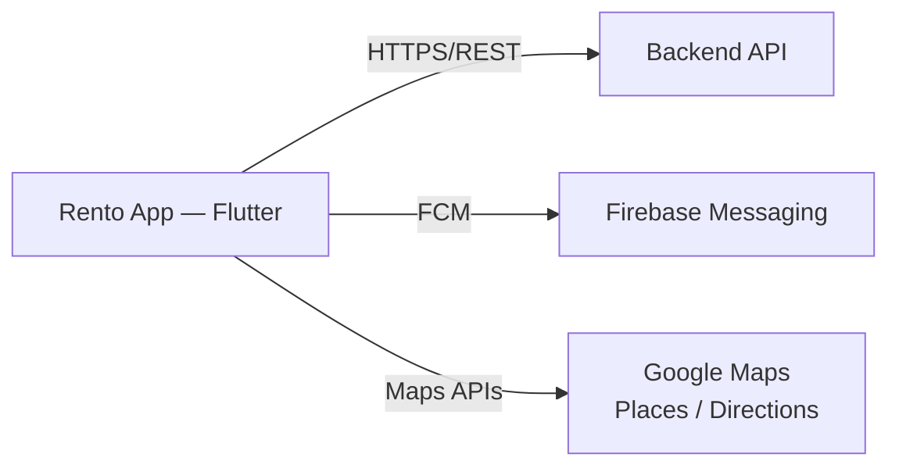
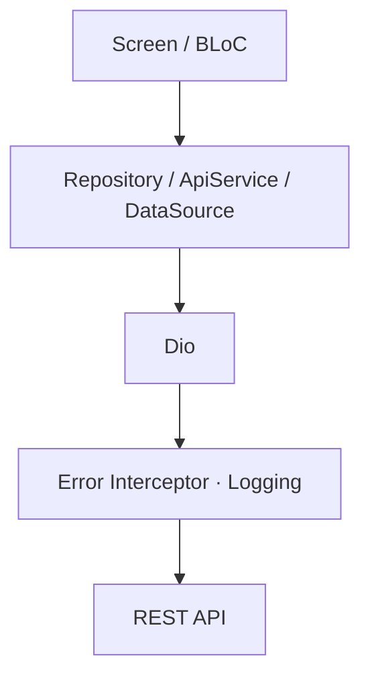
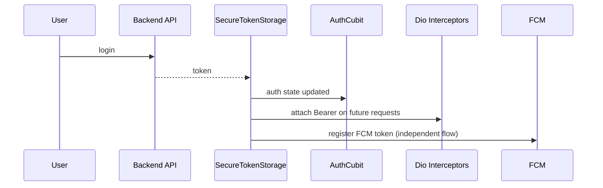
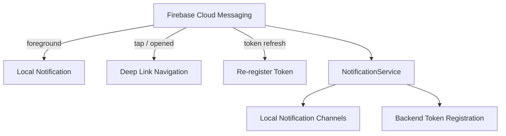

# Mobile Application — Architecture

**Live:** [App Store](https://apps.apple.com/de/app/rento-car-car-rental/id6760517523) · [Google Play](https://play.google.com/store/apps/details?id=com.rentocar.app)

This document describes the architecture of the merged Rento mobile application, which serves **two distinct product experiences — Customer and Rental Office — from a single Flutter binary**.

> **Diagrams:** see [`mobile-diagrams.md`](./diagrams/mobile-diagrams.md) for the full set of Mermaid diagrams (bootstrap sequence, role-based routing, secure token flow, security boundaries, test coverage map).

## Table of Contents

1. [System Context](#system-context)
2. [Application Modes](#application-modes)
3. [Layered Architecture](#layered-architecture)
4. [Dependency Injection](#dependency-injection)
5. [Networking](#networking)
6. [Authentication & Session](#authentication--session)
7. [Notifications](#notifications)
8. [Feature Module Map](#feature-module-map)
9. [Data Flow Examples](#data-flow-examples)
10. [Known Architectural Trade-offs](#known-architectural-trade-offs)

---

## System Context

The mobile app is a client for the car rental platform, communicating with a REST API backend and Firebase for push notifications. Google Maps powers location selection, delivery routing, and office-zone management.



---

## Application Modes

A single binary contains two product experiences. On launch, the app inspects auth state and user role, then routes to the appropriate shell:

| Mode | Navigation | State Pattern |
|---|---|---|
| **Customer** | Named routes + bottom tabs | Cubit (pragmatic layered) |
| **Rental Office** | Persistent bottom nav + drawer | BLoC + Clean Architecture |
| **Guest** | Same as Customer | Limited features (no in-app notification list) |

This is a deliberate architectural decision: the two experiences serve fundamentally different users (consumer vs. B2B operator) with different complexity profiles, so they were not forced into a single uniform pattern.

---

## Layered Architecture

### Customer Module — Pragmatic Cubit Architecture

```
Presentation (screens, widgets)
        ↓
State (Cubits)
        ↓
Data access (services, models)
        ↓
Infrastructure (Dio, security)
```

- Screens consume state via `context.read<XxxCubit>()` and `BlocBuilder`/`BlocListener`.
- A shared `ApiService` acts as the HTTP facade for most customer endpoints.

### Office Module — Clean Architecture

```
presentation/  → screens, widgets, BLoCs
      ↑
domain/        → entities, abstract repositories, use cases
      ↑
data/          → models, remote data sources, repository implementations
```

- Each feature is isolated under its own module directory.
- Dependency injection via **GetIt**; BLoCs receive use cases through constructor injection.

**Why two patterns coexist:** the Office module was built with stricter architectural discipline because it carries more complex, stateful business logic (fleet management, offers, order lifecycle, financial settlements) that benefits from explicit domain boundaries and testable use cases — while the Customer module optimizes for delivery speed on a comparatively simpler feature set.

---

## Dependency Injection

**Customer:** lightweight service locator (`Get.put()`) for cross-cutting singletons (theme, fonts, API service, auth service).

**Office:** a full DI container registers the dependency graph explicitly:

```dart
sl.registerLazySingleton<OfficeCarsRepository>(
  () => OfficeCarsRepositoryImpl(remote: sl(), networkInfo: sl()),
);
sl.registerFactory(OfficeCarsBloc.new);
```

Repositories and use cases are registered as lazy singletons; BLoCs as factories — so each screen gets a fresh BLoC instance while sharing the same underlying repository/data-source graph.

---

## Networking



**Centralized concerns handled by the interceptor pipeline:**
- Authentication and API-key headers
- Locale propagation (`Accept-Language`)
- Timeout and rate-limit (429) handling
- Normalized error mapping — a `DioException` is converted to a domain-friendly error before it ever reaches a Cubit/BLoC, which then emits an error state the UI renders consistently.

---

## Authentication & Session



- Tokens are stored via **encrypted secure storage**, not plain application state.
- Logout clears both secure storage and in-memory Cubit/BLoC state.
- Legacy plain-text tokens are migrated to secure storage transparently on first launch after the upgrade — protecting existing users without forcing a re-login.
- The locally-cached user profile explicitly excludes the raw token, so a compromised profile cache alone cannot leak the session.

---

## Notifications



Push notifications work for both guest and authenticated users; the **in-app notification list** requires authentication, since it reflects account-specific history rather than a device-level push event.

---

## Feature Module Map

**Customer (Cubits):** Auth, Search, Cars, Car Details, Checkout, Booking History, Notifications, Governorates (cached), Ads (cached), Airports, OTP.

**Office (BLoCs):** Cars (list/toggle/update/calendar), Offers (CRUD), Orders (load/accept/reject/delivery routing), Profile (profile/location/delivery zone), Finance (monthly settlement reports).

---

## Data Flow Examples

### Customer Booking

```
Search → SearchRepository → ApiService → emit SearchLoaded(cars)
   → CarDetails → CheckoutCubit.submitBooking()
   → CheckoutRepository (multipart if documents required)
   → emit CheckoutSuccess → navigate to confirmation
```

### Office — Accept Booking

```
OfficeOrdersScreen → BookingBloc.add(FetchBookingsEvent)
   → FetchBookingsUseCase → BookingRepository → RemoteDataSource → Dio
   → emit BookingsLoaded
   → user taps Accept → AcceptOrRejectBookingUseCase
   → emit AcceptOrRejectBookingSuccess
```

---

## Known Architectural Trade-offs

A meaningful part of engineering a production system is managing existing constraints rather than designing everything from a blank slate. These are documented explicitly rather than hidden:

| Trade-off | Rationale | Direction Forward |
|---|---|---|
| GetX (Customer) + BLoC (Office) coexist | Historical merge of two previously separate codebases into one binary | Gradually standardize on BLoC, or formally document the boundary as permanent |
| Dual HTTP clients | Customer module predates a later Dio-based refactor | Consolidate behind a single repository layer |
| Mixed plain storage + secure storage | Legacy user data pre-dates the secure-storage migration | Migrate remaining sensitive fields incrementally |
| Some large widget files | Prioritized rapid feature delivery under real deadlines | Incremental extraction as features stabilize |

The guiding principle: **improve architectural consistency while preserving delivery velocity and production stability** — not a disruptive rewrite that risks the working system.

---

## Build

```bash
flutter run                                            # development
flutter build apk --dart-define=API_KEY=<key>          # production
flutter analyze                                        # static analysis
```
