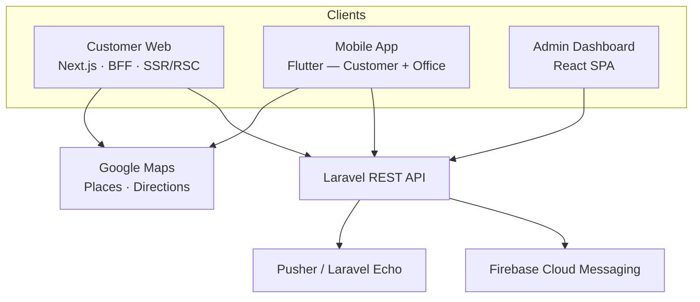

# Rento Car — Multi-Tenant Car Rental Platform

**Live:** [rentocar24.com](https://rentocar24.com/) · [App Store](https://apps.apple.com/de/app/rento-car-car-rental/id6760517523) · [Google Play](https://play.google.com/store/apps/details?id=com.rentocar.app)

Rento Car is a multi-tenant car rental platform connecting **customers** and **rental offices** through a unified ecosystem of applications sharing a common business domain and backend services.

The platform combines booking workflows, real-time vehicle availability, rental-office operations, geospatial delivery, financial settlements, and role-based access control into a single production system spanning **three independent client applications**.

> Code is kept in private repositories due to client/business confidentiality. This documentation set describes the system-level architecture and engineering decisions — happy to walk through any part of it in more depth in conversation.

---

## Product Ecosystem



| Application | Stack | Role |
|---|---|---|
| **[Customer Web](https://rentocar24.com/)** | Next.js (App Router), React, TypeScript, BFF | Public-facing booking platform, SSR/SEO-optimized |
| **Mobile App** — [App Store](https://apps.apple.com/de/app/rento-car-car-rental/id6760517523) · [Google Play](https://play.google.com/store/apps/details?id=com.rentocar.app) | Flutter, Dart, BLoC/Cubit | Single binary serving both Customer and Rental-Office experiences |
| **Admin Dashboard** | React SPA, Vite, Zustand | Platform administration, financial reporting, operational control |
| **Backend** | Laravel, REST API | Shared upstream service for all three clients |

Each client addresses a distinct operational boundary while consuming the same backend services — a **service-oriented client architecture** rather than three independently designed products.

---

## Core Engineering Challenges

The primary engineering challenge was not building isolated interfaces, but coordinating **three architecturally distinct applications** around one consistent business domain:

- Multi-tenant rental-office operations with isolated data boundaries
- Role-based access control across guest, customer, rental-office, and admin roles
- Stateful booking and vehicle-availability workflows (not simple CRUD)
- Geospatial delivery routing and office-zone management
- Real-time order state propagation across three different client types
- Financial settlement and reconciliation between the platform and rental offices
- Secure, consistent authentication across web, mobile, and dashboard clients
- Production deployment, observability, and long-term maintainability

---

## Deep-Dive Architecture Documentation

Each client application has its own architecture-level documentation, covering system design, security model, state management, and deliberate engineering trade-offs:

| Document | Covers |
|---|---|
| **[Web Architecture](./docs/web-architecture.md)** · [Diagrams](./docs/web-diagrams.md) | Next.js BFF pattern, HttpOnly session model, secure API proxy, auth flows, SSR/RSC data access |
| **[Mobile Architecture](./docs/mobile-architecture.md)** · [Diagrams](./docs/mobile-diagrams.md) | Flutter dual-module design (Cubit + Clean Architecture), dependency injection, secure token storage, real-time push notifications |
| **[Dashboard Architecture](./docs/dashboard-architecture.md)** · [Diagrams](./docs/dashboard-diagrams.md) | React SPA feature-based structure, JWT session handling, Pusher real-time notifications, i18n/RTL |

---

## Cross-Cutting Technology Stack

| Area | Technologies |
|---|---|
| **Web** | Next.js · React · TypeScript · Tailwind CSS |
| **Admin** | React · Vite · Zustand · React Router |
| **Mobile** | Flutter · Dart · BLoC · Cubit · GetIt (DI) |
| **Backend** | Laravel · REST API |
| **Real-Time** | Laravel Echo · Pusher · Firebase Cloud Messaging |
| **Maps & Geospatial** | Google Maps Platform (Places, Directions) |
| **Auth & Security** | HttpOnly Cookies · Bearer Tokens · Encrypted Secure Storage · API Allowlisting |
| **Infrastructure** | Docker · Nginx · Linux · CI/CD |
| **Networking** | Axios · Dio (with interceptor pipeline) |

---

## Engineering Approach

Building Rento Car required working across the full software lifecycle for three parallel applications:

```
Requirements → Domain Modeling → Architecture → Implementation
      → Testing & Review → Deployment → Production Iteration
```

Responsibilities spanned architectural planning, technical decision-making, task decomposition, engineering coordination, code review, testing, release validation, and ongoing improvement — leading a team of up to **7 engineers** while remaining hands-on across all three client applications.

A deliberate engineering principle throughout: **improve architectural consistency while preserving delivery velocity and production stability** — documented explicitly in each architecture doc's trade-offs section, rather than presenting the system as a theoretical ideal.

---

## Related Documentation

- [`web-architecture.md`](./web-architecture.md) — Customer Web (Next.js BFF)
- [`docs/mobile-architecture.md`](./docs/mobile-architecture.md) — Mobile (Flutter)
- [`docs/dashboard-architecture.md`](./docs/dashboard-architecture.md) — Admin Dashboard (React SPA)
