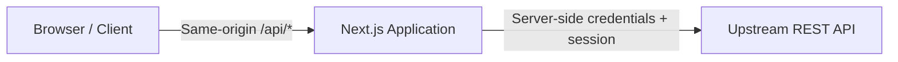
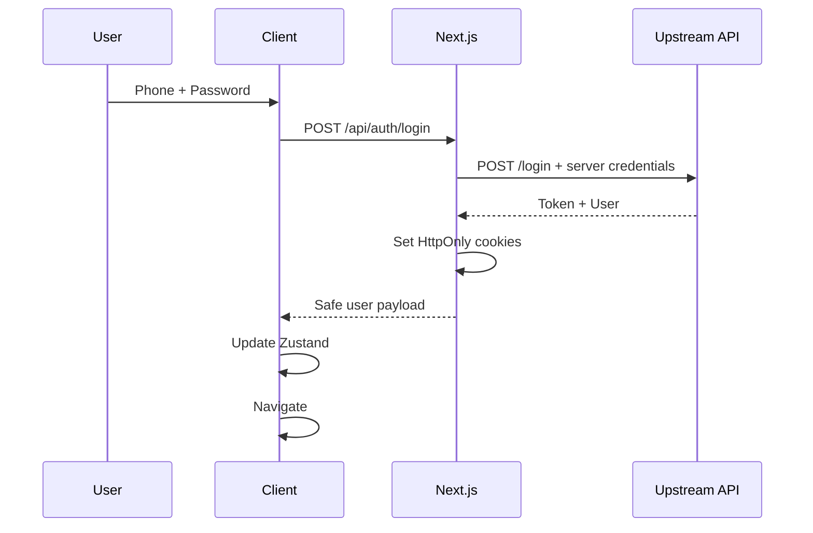
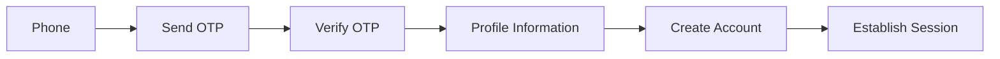
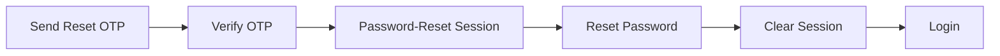
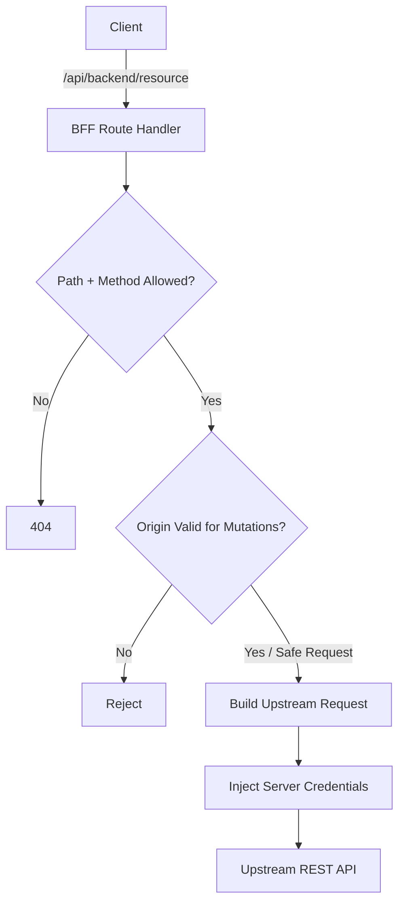
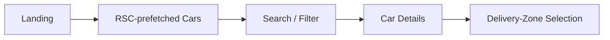
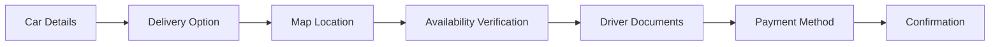

# Customer Web — Architecture, Features & Security

**Live:** [rentocar24.com](https://rentocar24.com/)

## Overview

Customer Web is the customer-facing web application for **Rento Car**, a multi-feature car-rental platform.

The application is built with **Next.js App Router, React, and TypeScript**, and follows a **Backend-for-Frontend (BFF)** architecture to establish a controlled boundary between the browser and the upstream REST API.

The architecture combines:

* Feature-based modular organization
* Server-side API mediation through Next.js Route Handlers
* HttpOnly session cookies
* Server-only upstream credentials
* Explicit API path/method allowlisting
* Same-origin request validation for mutations
* Server-side rendering and cacheable RSC data fetching
* Client-side state management with Zustand
* Type-safe shared infrastructure
* SEO-oriented rendering for public content
* Explicit security hardening and documented future improvements

The goal is to keep the browser-facing application simple while concentrating authentication, credential handling, request validation, and upstream API access at a controlled server boundary.

> **Architecture diagrams:** see [`web-diagrams.md`](./diagrams/Web-diagrams.md) for the full set of Mermaid flowcharts and sequence diagrams.

## Table of Contents

1. [Architecture Overview](#architecture-overview)
2. [Architectural Principles](#architectural-principles)
3. [Feature Modules](#feature-modules)
4. [Security Architecture](#security-architecture)
5. [Authentication & Session Management](#authentication--session-management)
6. [BFF API Access Pattern](#bff-api-access-pattern)
7. [Rendering & Data Access Strategy](#rendering--data-access-strategy)
8. [Project Structure](#project-structure)
9. [End-to-End Product Flows](#end-to-end-product-flows)
10. [State, i18n & SEO](#state-i18n--seo)
11. [Key Technologies](#key-technologies)
12. [Operational Hardening](#operational-hardening)
13. [Security Roadmap](#security-roadmap)
14. [Engineering Summary](#engineering-summary)

---

## Architecture Overview



The browser communicates only with the application's own origin through Next.js Route Handlers — never directly with the upstream API.

The Next.js server communicates with the upstream REST API using server-side credentials, the HttpOnly session, and server-side request handling.

This creates a **Backend-for-Frontend (BFF)** layer: the BFF enforces the browser-facing API boundary instead of exposing the upstream API directly to client code.

---

## Architectural Principles

### 1. Explicit Trust Boundaries

Browser code is treated as untrusted. Sensitive credentials and upstream access tokens remain server-side and are excluded from client-exposed environment variables and browser storage.

### 2. Feature Ownership

Business capabilities are grouped by feature — components, hooks, services, types, and public exports — rather than by technical layer alone.

This keeps related behavior close together while avoiding unnecessary micro-frontend complexity.

### 3. Centralized API Mediation

Client requests use a shared API abstraction and pass through the BFF.

This avoids duplicating:

* Authentication forwarding
* API-key injection
* Request validation
* Error normalization
* Access rules
* Upstream request construction

across individual features.

### 4. Dedicated Authentication Boundaries

Operations that establish or modify HttpOnly cookies use dedicated Route Handlers instead of the generic domain proxy.

This keeps session establishment and authentication state changes under explicit server-side control.

### 5. Rendering Based on Data Characteristics

Rendering and data-access strategies are selected according to the nature of the data:

* Public and cacheable content → server-side rendering / RSC
* Indexable resources → server-rendered routes
* Interactive workflows → client-side requests
* Authenticated and mutation-heavy workflows → client hooks through the BFF

### 6. Security Through Layered Controls

Security is implemented as multiple complementary controls rather than relying on a single mechanism:

* HttpOnly cookies
* Server-only credentials
* API allowlisting
* Same-origin validation
* Rate limiting
* Security headers
* Input normalization
* Error boundaries
* CI validation

Each layer addresses a different class of failure or exposure.

---

## Feature Modules

The application follows a feature-based modular structure under `features/`:

```text
features/<name>/
  components/
  hooks/
  services/
  types/
  index.ts
```

| Feature           | Responsibility                                                                                 |
| ----------------- | ---------------------------------------------------------------------------------------------- |
| `login`           | Phone/password authentication                                                                  |
| `register`        | OTP-based account registration                                                                 |
| `forgot-password` | OTP-based password recovery                                                                    |
| `send-otp`        | Standalone OTP request flow                                                                    |
| `home-booking`    | Home-page booking entry and quick search                                                       |
| `cars`            | Search, filtering, daily/weekly/fixed-30-day pricing, car details, delivery-zone map selection |
| `booking`         | Availability verification, checkout, documents, payment method, confirmation                   |
| `airport-taxi`    | Airport transfer request workflow                                                              |
| `my-bookings`     | Booking history, invoice breakdown, discounts, ratings                                         |
| `account`         | Profile management and password-confirmed account deletion                                     |
| `notifications`   | In-app notification inbox                                                                      |
| `contact`         | Public contact and support information                                                         |
| `legal`           | Privacy policy, terms, and account-deletion policy content                                     |

### Feature Notes

* `cars/[id]` is a dedicated, shareable, indexable route rather than modal-only navigation.
* Delivery-zone selection belongs to the car-discovery flow and uses an interactive map.
* Booking checkout is responsible for the transactional workflow after car selection.

### Booking Checkout

```text
Car Selection
    ↓
Delivery Selection
    ↓
Availability Verification
    ↓
Driver Documents
    ↓
Payment Method
    ↓
Booking Confirmation
```

---

## Security Architecture

### Session Cookies

| Cookie        | Purpose                    | Flags                                                |
| ------------- | --------------------------- | ------------------------------------------------------ |
| `accessToken` | Upstream API bearer token  | HttpOnly, SameSite=Lax, Secure in production, Path=/ |
| `rento_user`  | Safe user-profile snapshot | HttpOnly, SameSite=Lax, Secure in production, Path=/ |

Because these cookies are HttpOnly, `document.cookie` cannot read them from client-side JavaScript.

This does not eliminate XSS risk, but it keeps the upstream session token outside the normal JavaScript-readable cookie surface.

### Credential & Token Handling

* The upstream API key exists only in server-side Route Handlers.
* It is never assigned to a `NEXT_PUBLIC_*` variable.
* It is never included in the client bundle.
* The client Axios instance is scoped to `/api/backend`.
* No authentication token is stored in `localStorage` or `sessionStorage`.
* The BFF reads `accessToken` from the HttpOnly cookie server-side.
* The BFF attaches the Bearer token when forwarding authenticated requests to the upstream API.

```text
Browser
   │
   │ /api/backend/...
   ▼
Next.js BFF
   │
   ├── Server-side API Key
   ├── HttpOnly accessToken
   └── Request validation
   │
   ▼
Upstream REST API
```

### Client-Side User State

Zustand (`useUserStore`) holds a safe `UserProfile` for UI rendering only.

It is **not the authentication authority**.

The trust chain is:

```text
HttpOnly Session
      ↓
/api/auth/session
      ↓
Safe User Object
      ↓
Zustand
      ↓
UI
```

### Phone Normalization

A shared phone-normalization utility is used across:

* Login
* OTP
* Registration
* Password reset
* Booking
* Airport taxi

The utility handles digit normalization, country-code formatting, and duplicate-prefix prevention.

This keeps phone identity consistent between OTP verification, account operations, and transactional requests.

---

## Authentication & Session Management

### Login



The browser receives a safe user payload rather than the raw upstream token.

### Registration



OTP operations pass through the BFF.

Account creation uses a dedicated authentication Route Handler so the server can establish HttpOnly cookies directly from the trusted upstream response.

Client-supplied `role` information is stripped server-side and is not treated as an authority.

### Forgot Password



The `password-reset-session` route establishes temporary authenticated state only from the verified upstream response.

Client-submitted `token` or `role` values are never trusted as authoritative session data.

### Logout & Session Lifecycle

**Logout**

1. Read the server-side HttpOnly session.
2. Notify the upstream API when a valid token exists.
3. Clear session cookies.
4. Clear Zustand state.
5. Clean up FCM token state.

**Session Probe**

`GET /api/auth/session` returns:

```json
{
  "authenticated": true,
  "user": {}
}
```

without exposing the access token.

A root-level `SessionHydrator` uses this endpoint to restore UI state after a page refresh.

**User Synchronization**

`POST /api/auth/sync-user` refreshes the profile cookie from the upstream `GET /user` response.

The profile is therefore derived from the trusted upstream response rather than from a client-supplied profile object.

---

## BFF API Access Pattern

Domain requests — including cars, booking, airport taxi, bookings, account, notifications, and contact — use a shared client API abstraction targeting:

```text
/api/backend/*
```

These requests are handled by one catch-all Route Handler.



### Request Processing

The BFF:

1. Checks the requested path and HTTP method against an explicit allowlist.
2. Rejects unknown path/method combinations.
3. Validates the request origin for mutation requests.
4. Rebuilds the upstream URL while preserving the required query, method, body, and relevant headers.
5. Injects server-side API credentials.
6. Attaches the Bearer token when an authenticated upstream request requires it.
7. Applies in-memory rate limiting to sensitive authentication and OTP mutation paths.

### Authentication Exceptions

The following operations use dedicated Route Handlers:

```text
/api/auth/login
/api/auth/signup
/api/auth/password-reset-session
```

These routes are separated from the generic domain proxy because they establish or modify the application's HttpOnly session state.

The remaining domain features share the centralized allowlisted BFF boundary.

---

## Rendering & Data Access Strategy

| Feature                | Strategy                           | Rationale                              |
| ----------------------- | ------------------------------------ | ----------------------------------------- |
| Cars listing / landing | RSC + revalidation                 | Public, cacheable, SEO-relevant        |
| `cars/[id]`            | Server-side fetch                  | Shareable and indexable                |
| Delivery-zone map      | Client-side Leaflet                | Interactive location selection         |
| Home booking           | Client hooks + abort-safe requests | Interactive search refinement          |
| Booking                | Client hooks + `AbortController`   | Authenticated, mutation-heavy workflow |
| Airport taxi           | Client hooks + `AbortController`   | Authenticated, mutation-heavy workflow |
| My bookings            | Client hooks through BFF           | Authenticated, user-specific           |
| Account                | Client hooks through BFF           | Authenticated, user-specific           |
| Notifications          | Client hooks through BFF           | Authenticated, user-specific           |
| Contact                | Public GET through BFF             | No authentication required             |
| Legal                  | RSC/static content                 | Public and cache-friendly              |

### Server-Side Public Data

Public data used during RSC rendering — such as cars, governorates, and airports — can use a server-only `upstreamFetch` helper rather than going through the browser-facing proxy path.

This avoids an unnecessary browser-to-BFF round trip for server-rendered public data while keeping the upstream API inaccessible to browser code.

It also enables:

* Server-side prefetching
* Cacheable public responses
* Faster initial rendering
* SEO-friendly HTML
* Server-only access to upstream configuration

The helper is kept outside the client-accessible code path.

### Abort-Safe Interactive Requests

Interactive search and booking workflows can generate multiple requests as users refine their selections.

`AbortController` is used to cancel stale requests where appropriate.

This prevents an older, slower response from overwriting newer UI state and reduces unnecessary work for requests that are no longer relevant.

---

## Project Structure

```text
app/
├── api/
│   ├── auth/
│   │   ├── login/
│   │   ├── signup/
│   │   ├── logout/
│   │   ├── session/
│   │   ├── clear/
│   │   ├── password-reset-session/
│   │   └── sync-user/
│   │
│   └── backend/
│       └── [...path]/
│
├── cars/
│   └── [id]/
│
components/

features/
├── login/
├── register/
├── forgot-password/
├── send-otp/
├── home-booking/
├── cars/
├── booking/
├── airport-taxi/
├── my-bookings/
├── account/
├── notifications/
├── contact/
└── legal/

lib/
├── phone/
├── auth/
├── server/
├── seo/
└── router/

hooks/
└── useApi.ts

store/
├── user/
└── loading/

i18n/
└── locales/

public/
└── contact.html
```

### Shared Infrastructure

**`lib/phone/`**

Shared phone normalization and formatting logic.

**`lib/auth/`**

Cookie names, session helpers, authentication types, and session-related utilities.

**`lib/server/`**

Server-only upstream configuration, request forwarding, API allowlisting, request guards, and RSC data-fetching helpers.

**`lib/seo/`**

Metadata builders, sitemap generation, and structured data.

**`lib/router/`**

Centralized route definitions and path constants.

**`hooks/useApi.ts`**

Shared client-side API abstraction with normalized success and error handling.

**`store/`**

Lightweight Zustand state for UI concerns such as user presentation state and loading state.

---

## End-to-End Product Flows

### Customer Discovery



### Booking



### Airport Taxi

```text
Airport Taxi Form
    ↓
Validation
    ↓
BFF Request
    ↓
Upstream Persistence
    ↓
Bookings
```

### Booking History

```text
My Bookings
    ↓
Booking Details
    ↓
Invoice Breakdown
    ↓
Discounts
    ↓
Rating
```

Invoice discount fields such as:

```text
special_offer_amount
coupon_amount
points_amount
```

are rendered only when their values are greater than zero.

### Account Lifecycle

```text
Registration
    ↓
OTP Verification
    ↓
Authenticated Session
    ↓
Profile Management
    ↓
Notifications
    ↓
Logout / Account Deletion
```

---

## State, i18n & SEO

### State

Server-backed data includes:

* Cars
* Availability
* Bookings
* Account data
* Notifications
* Airport taxi requests

These are retrieved through the appropriate server/BFF path.

Zustand is intentionally kept lightweight and is used for UI state such as:

* Current safe user profile
* Loading state

It is never treated as the authentication authority.

### Internationalization

Arabic and English are supported through:

```text
i18n/locales/
```

Typed message definitions help keep translation keys consistent across features and reduce hard-coded user-facing strings.

### SEO

SEO functionality is centralized under:

```text
lib/seo/
```

It includes:

* Page metadata builders
* Sitemap generation
* JSON-LD structured data
* Dedicated car-detail URLs
* Server-rendered public content

Public discovery flows remain indexable while authenticated areas remain user-specific.

---

## Key Technologies

| Technology                  | Role                                                                                               |
| ----------------------------- | ------------------------------------------------------------------------------------------------------ |
| **Next.js**                 | App Router, React Server Components, Route Handlers, server-side BFF, standalone production output |
| **React / TypeScript**      | UI layer and type safety                                                                           |
| **Axios**                   | Client HTTP abstraction scoped to `/api/backend`                                                   |
| **Zustand**                 | Lightweight client-side state                                                                      |
| **Tailwind CSS**            | Styling                                                                                            |
| **Leaflet / React-Leaflet** | Interactive delivery-zone map                                                                      |
| **Docker**                  | Multi-stage production containerization                                                            |

---

## Operational Hardening

### Transport

HTTPS is used in production so secure cookies can be transmitted with the intended security attributes.

### API Boundary

The BFF applies:

* Explicit path/method allowlisting
* Same-origin validation for mutations
* Server-side credential injection
* Controlled request forwarding

### Rate Limiting

Sensitive authentication and OTP mutation paths use in-memory rate limiting.

This provides a lightweight control appropriate to the current deployment model.

### Security Headers

The application configures security-related response headers including:

* `X-Frame-Options`
* `X-Content-Type-Options: nosniff`
* `Referrer-Policy`
* `Permissions-Policy`
* `Strict-Transport-Security` / HSTS

### Error Handling

The application uses:

* Global error boundaries
* Route-level error boundaries
* Normalized API error handling

This prevents individual request failures from unnecessarily destabilizing the overall application UI.

### CI Validation

The project validates changes through:

* Linting
* Type checking
* Production build

---

## Security Roadmap

Security is treated as an iterative engineering process rather than a completed task.

The following improvements are intentionally documented as future hardening work.

### Distributed / Edge Rate Limiting

The current in-memory rate limiter is suitable for the present deployment model but does not share state between multiple application instances.

A distributed or edge-based solution becomes more appropriate when horizontal scaling requires shared rate-limit state.

### Formal Content Security Policy

A formal CSP can provide an additional browser-side defense layer against certain classes of script injection and XSS.

### Structured Logging & Monitoring

Future operational hardening can include:

* Structured application logs
* Centralized error tracking
* Performance monitoring
* Security-event monitoring
* Alerting and operational dashboards

Tools such as Sentry can be introduced when operational requirements justify the additional infrastructure.

Documenting these separately keeps **implemented controls** clearly distinguished from **planned hardening**.

---

## Engineering Summary

```text
                           Browser
                              │
                              │ Same-Origin /api
                              ▼
                    ┌────────────────────┐
                    │      Next.js       │
                    │        BFF         │
                    ├────────────────────┤
                    │ Auth Boundaries    │
                    │ API Allowlist      │
                    │ Origin Checks      │
                    │ Rate Limiting      │
                    │ Session Cookies    │
                    │ Request Validation │
                    └─────────┬──────────┘
                              │
                    Server-side credentials
                              │
                              ▼
                    ┌────────────────────┐
                    │   Upstream REST    │
                    │        API         │
                    └────────────────────┘
```

Customer Web combines:

* BFF-based API mediation
* HttpOnly session management
* Server-side credential protection
* Explicit authentication boundaries
* Feature-based modular architecture
* Data-aware rendering
* SEO-oriented public rendering
* Abort-safe interactive requests
* Centralized shared infrastructure
* Layered security controls
* Containerized production deployment
* Explicitly documented security roadmap

The resulting architecture provides a clear separation between **browser concerns, application-level orchestration, and upstream API access**, while keeping authentication, security controls, rendering strategy, and feature ownership explicit and maintainable.

This document describes the current Customer Web architecture, its implemented security controls, rendering strategy, feature boundaries, and explicitly deferred hardening work.
