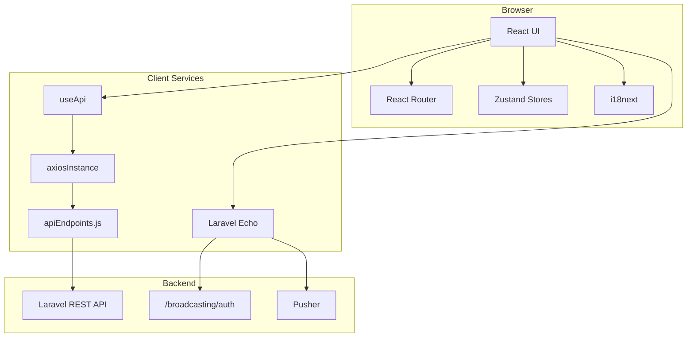
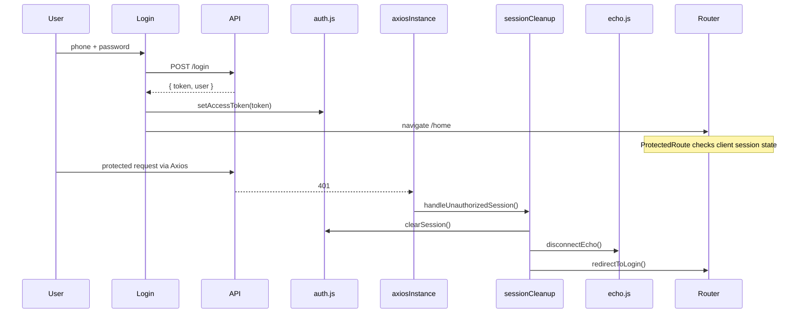
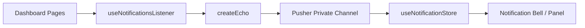

# Admin Dashboard — Architecture

An administrative single-page application (SPA) for the car rental platform. Built with React and communicating with a Laravel REST API, with real-time notifications delivered through Laravel Echo + Pusher.

The dashboard acts as an administrative client and does not access the database directly. Business operations and server-side authorization are handled by the backend API.

> **Diagrams:** see [`dashboard-diagrams.md`](./diagrams/dashboard-diagrams.md) for C4, UML state/sequence, defense-in-depth, and deployment diagrams.


## Table of Contents

1. [Overview](#overview)
2. [System Architecture](#system-architecture)
3. [Application Flow](#application-flow)
4. [Authentication & Authorization](#authentication--authorization)
5. [Folder Structure](#folder-structure)
6. [Application Layers](#application-layers)
7. [Feature Modules](#feature-modules)
8. [Real-Time Notifications](#real-time-notifications)
9. [Internationalization (i18n)](#internationalization-i18n)
10. [Error Handling](#error-handling)
11. [Environment Variables](#environment-variables)
12. [Deployment](#deployment)
13. [API Conventions](#api-conventions)
14. [Security Model](#security-model)
15. [Testing & Release Validation](#testing--release-validation)
16. [Adding a New Feature](#adding-a-new-feature)

---

## Overview

| Property         | Value                                |
| ---------------- | ------------------------------------ |
| Type             | Single Page Application (SPA)        |
| Base path        | `/dashboard/`                        |
| Frontend         | React                                |
| State management | Zustand                              |
| Routing          | React Router                         |
| API client       | Axios                                |
| Languages        | Arabic (default), English            |
| Direction        | RTL / LTR, driven by active language |
| Authentication   | JWT Bearer token                     |
| Real-time        | Laravel Echo + Pusher                |
| Styling          | Tailwind CSS                         |
| Deployment       | Docker + Nginx                       |

---

## System Architecture

The dashboard is a browser-based administrative client positioned between the administrator and the Laravel backend.

```text
┌──────────────────────────────┐
│        Administrator         │
└──────────────┬───────────────┘
               │ HTTPS
               ▼
┌──────────────────────────────┐
│       React Admin SPA        │
│                              │
│ UI / Router / Zustand / i18n │
│ useApi / Axios / Echo        │
└──────────────┬───────────────┘
               │ REST API
               │ Bearer Token
               │ x-api-key
               ▼
┌──────────────────────────────┐
│        Laravel API           │
│                              │
│ Authentication               │
│ Authorization / RBAC         │
│ Validation                   │
│ Business Logic               │
│ Data Access                  │
└──────────────┬───────────────┘
               │
               ▼
          ┌──────────┐
          │ Database │
          └──────────┘

Real-time path:

Laravel ──► Pusher ──► Laravel Echo ──► React Notification Store
```

### Architectural Boundary

The browser is treated as an untrusted client.

Client-side route guards, validation, and UI restrictions improve user experience but are **not treated as security boundaries**. Authentication, authorization, validation, and business rules are enforced by the backend.

---

## Application Flow



The standard feature request path is:

```text
Page
  ↓
useApi()
  ↓
axiosInstance
  ↓
apiEndpoints
  ↓
Laravel REST API
```

This centralizes API communication, authentication headers, response handling, and common error behavior.

---

## Authentication & Authorization

### Authentication Flow



### Key Authentication Files

| File                                | Responsibility                                       |
| ----------------------------------- | ---------------------------------------------------- |
| `src/features/auth/pages/Login.jsx` | Login screen                                         |
| `src/utils/auth.js`                 | Token and session management                         |
| `src/utils/sessionCleanup.js`       | Centralized session cleanup                          |
| `src/components/ProtectedRoute.jsx` | Client-side route protection                         |
| `src/components/GuestRoute.jsx`     | Prevents authenticated users from returning to login |
| `src/services/axiosInstance.js`     | Attaches authentication and API headers              |
| `src/components/LogoutButton.jsx`   | Logout handler                                       |

### Authentication vs Authorization

Authentication determines **who the user is**.

Authorization determines **what the authenticated user is allowed to do**.

The dashboard provides client-side route protection through `ProtectedRoute`, but this is not considered an authorization boundary.

Server-side authorization and role/permission enforcement remain the responsibility of the Laravel API.

```text
Authentication
    ↓
JWT Bearer Token
    ↓
Laravel API
    ↓
Authorization / Permissions
    ↓
Business Operation
```

This ensures that hiding a route or UI action in the browser cannot be relied upon to protect backend resources.

### Session Expiration

When the API returns an authentication failure such as `401`, the Axios interceptor invokes a centralized cleanup flow:

```text
401
 ↓
handleUnauthorizedSession()
 ↓
clearSession()
 ↓
disconnectEcho()
 ↓
redirectToLogin()
```

This prevents different parts of the application from implementing inconsistent logout behavior.

---

## Folder Structure

```text
src/
├── app/                    # application entry point
│   ├── App.jsx             # Router + i18n direction + ScrollToTop + ErrorBoundary
│   ├── routes.jsx          # route table (React.lazy + Suspense)
│   └── i18n.js             # i18next setup
├── page/                   # application-level / standalone pages
├── assets/                 # logos and static images
├── features/               # feature-based domain modules
│   ├── auth/
│   ├── office/
│   ├── cars/
│   ├── bookings/
│   ├── airport-requests/
│   ├── reports/
│   ├── ads/
│   ├── coupons/
│   ├── messages/
│   ├── notifications/
│   ├── points/
│   ├── users/
│   ├── contact/
│   └── rental-terms/
├── components/             # shared UI (ProtectedRoute, GuestRoute, ErrorBoundary, LoadingSpinner)
├── layouts/                # application layout shell
├── hooks/                  # reusable React hooks
├── services/               # API and real-time services
├── store/                  # Zustand stores
├── utils/                  # auth, sessionCleanup, safeUrl
└── styles/                 # global styles
```

### Organizing Principle

The application follows a **feature-based structure**.

Business domains are isolated under:

```text
src/features/<domain>/
```

Feature-specific pages and components remain close to their domain, while genuinely cross-cutting UI such as `ProtectedRoute` and `LoadingSpinner` remains in shared directories.

This improves maintainability and reduces unnecessary coupling between business domains.

---

## Application Layers

### 1. Presentation Layer

* **Pages** — compose data fetching, feature components, and layout for complete screens.
* **Components** — reusable UI within a feature or across the application.
* **Layouts** — persistent application shell such as sidebar, navigation, language switcher, notification bell, and logout.
* **ErrorBoundary** — wraps the application in `App.jsx` so unexpected UI failures can recover without a blank screen.

### 2. State Layer

| Store         | File                      | Purpose                      |
| ------------- | ------------------------- | ---------------------------- |
| User          | `useUserStore.js`         | Authenticated user data      |
| Loading       | `useLoadingStore.js`      | Global loading state         |
| Notifications | `useNotificationStore.js` | Real-time notification state |

The authentication token is managed separately by `auth.js` rather than being persisted through Zustand.

This keeps **authentication/session state** conceptually separate from **UI/application state**.

### 3. Data Layer

```text
Page
 ↓
useApi()
  ↓
axiosInstance
  ↓
apiEndpoints.js
  ↓
Laravel REST API
```

* `useApi` provides the standard request path for feature-level API calls.
* It normalizes API success/error handling for the UI.
* `apiEndpoints.js` centralizes API paths used by the dashboard.
* `axiosInstance` centralizes `baseURL`, authentication headers, `x-api-key`, and response interceptors.

### 4. Routing Layer

* The application is mounted under `/dashboard/`.
* Vite and React Router use the same basename.
* Feature pages are loaded with `React.lazy` and `Suspense`.
* Application routes are protected through `<ProtectedRoute>`.
* `/login` is handled through `<GuestRoute>`.
* `ScrollToTop` resets scroll position on route changes.

---

## Feature Modules

| Feature           | Route                     | Description                                     |
| ----------------- | ------------------------- | ----------------------------------------------- |
| Home              | `/home`                   | Quick-access overview                           |
| Offices           | `/offices`                | CRUD for rental offices, offers, and financials |
| Cars              | `/cars`                   | Vehicles scoped per office                      |
| Bookings          | `/bookings/unfinished`    | Incomplete bookings                             |
| Airport Requests  | `/airport-requests`       | Airport delivery requests                       |
| Reports           | `/reports`                | Financial summaries with coupon filters         |
| Ratings           | `/ratings`                | Ratings reporting                               |
| Ads               | `/ads`                    | Advertisement management                        |
| Coupons           | `/coupons`                | Discounts scoped by rental type                 |
| Messages          | `/messages`               | Outbound messaging                              |
| Points Rules      | `/points-rules`           | Loyalty point configuration                     |
| Users             | `/users`                  | User management                                 |
| Contact Info      | `/contact-info`           | Contact information                             |
| Rental Terms      | `/rental-terms`           | Rental terms display                            |
| Office Settlement | `/offices/:id/settlement` | Office settlement confirmation                  |

### Example Flow — Offices & Offers

```text
/offices
    ↓
Office list

/offices/create
    ↓
Create office
    ↓
FormData

/offices/:id
    ↓
Office detail
    ↓
Offers

/offices/:id/edit
    ↓
Edit office

/offices/:id/finance
    ↓
Financial transactions

/offices/:id/settlement
    ↓
Settlement confirmation
```

### Example Flow — Cars

```text
/cars?office=5
    ↓
Cars scoped to office 5

/cars/:id?office=5
    ↓
Car detail
    ↓
Back navigation
    ↓
/cars?office=5
```

The office context is preserved through the query parameter to maintain navigation context between list and detail views.

---

## Real-Time Notifications



* Laravel Echo establishes the client-side real-time connection.
* Echo connects only when a valid authentication token is available.
* Notifications use a private user-scoped channel: `user.{id}`.
* The dashboard listens for `.request.made`.
* Received events are stored in `useNotificationStore`.
* Session cleanup disconnects Echo when authentication becomes invalid.

This keeps real-time notification delivery separate from the standard REST request path.

---

## Internationalization (i18n)

* Translation files are stored under `public/locales/{ar|en}/translation.json`.
* Translation resources are loaded over HTTP at runtime.
* `document.documentElement.dir` is updated according to the active language.
* Nested translation keys are supported, such as `price_type.daily`.
* Dynamic translation helpers provide Arabic/English fallbacks where required.

### UI Technology

* Tailwind CSS for styling
* `react-icons` / `lucide-react` for icons
* `framer-motion` for motion
* `recharts` for reporting charts
* `react-leaflet` for maps

Design tokens:

| Token     | Value     |
| --------- | --------- |
| Primary   | `#F4C034` |
| Secondary | `#1E1E5C` |
| Light     | `#E9E9E9` |

---

## Error Handling

The application uses centralized request handling to provide consistent API behavior.

`ErrorBoundary` wraps the router so unexpected render failures can be recovered by reloading the page.

### Error Categories

| Condition                      | Handling                                                                      |
| ------------------------------ | ----------------------------------------------------------------------------- |
| Successful API response        | Return normalized data to feature                                             |
| Validation error               | Surface field-level errors where available                                    |
| `401 Unauthorized`             | Clear session and redirect to login                                           |
| `403 Forbidden`                | Surface authorization failure without treating it as automatic session expiry |
| Network / connectivity failure | Surface a generic request failure                                             |
| Unexpected server error        | Surface a generic server-side error                                           |
| Pusher connection failure      | Keep notification failure isolated from REST functionality                    |

The backend remains responsible for authoritative validation and business-rule enforcement.

Client-side validation is primarily used for user experience and early feedback.

---

## Environment Variables

| Variable                  | Purpose                                 |
| ------------------------- | --------------------------------------- |
| `VITE_API_BASE_URL`       | REST API base URL                       |
| `VITE_API_BASE_URL_file`  | Media/file asset base URL               |
| `VITE_API_KEY`            | `x-api-key` identifier                  |
| `VITE_LANGUAGE`           | Default language hint for the build     |
| `VITE_PUSHER_KEY`         | Pusher public key                       |
| `VITE_PUSHER_CLUSTER`     | Pusher cluster                          |
| `VITE_BROADCAST_AUTH_URL` | Private-channel authentication endpoint |

> **Security note:** Vite environment variables are embedded into the client bundle at build time. Values exposed through `VITE_*` must therefore be considered public and must never contain secrets.

The `x-api-key` value is treated as a public application identifier rather than a secret credential.

---

## Deployment

The application is built as a static production bundle and served through Nginx.

```text
Source Code
    ↓
npm run build
    ↓
Vite production bundle
    ↓
dist/
    ↓
Docker image
    ↓
Nginx
    ↓
/dashboard/
```

The default Docker mapping is `8080` → `/dashboard/`.

### Nginx Responsibilities

* Serve static SPA assets
* Provide SPA fallback routing
* Serve the application under `/dashboard/`
* Apply configured security-related HTTP headers
* Handle static asset delivery

The application does not require a Node.js runtime in production because the built SPA is served as static assets by Nginx.

---

## API Conventions

### Success

```json
{
  "success": true,
  "message": "...",
  "data": {}
}
```

### Error

```json
{
  "success": false,
  "message": "...",
  "errors": {
    "field": ["..."]
  }
}
```

### Request Conventions

* File uploads use `multipart/form-data`.
* Offices, cars, and advertisements may use multipart requests.
* Some backend updates use `POST` rather than `PUT`, following the established API contract.
* Boolean values are frequently transmitted as `1` / `0` within `FormData`.

`apiEndpoints.js` centralizes client-side API paths; the Laravel API remains the authoritative source of the backend contract.

The frontend follows the existing backend API contract rather than introducing a separate request abstraction for individual features.

---

## Security Model

The security model follows a **defense-in-depth** approach.

### Authentication

* JWT Bearer token authentication
* Client-side token expiry checks
* Centralized Axios interceptor for authentication failures
* Centralized session cleanup
* Echo disconnection during session cleanup
* No hardcoded user tokens

### Authorization

* Client-side route protection through `ProtectedRoute`
* Server-side authorization enforced by the Laravel API
* UI-level restrictions are treated as usability controls, not security boundaries

### Browser Security

* Nginx security-related HTTP headers
* No secrets exposed through `VITE_*` environment variables
* No reliance on client-side validation for security enforcement
* No hardcoded authentication credentials
* External links are sanitized through `safeUrl.js` so only `http:` / `https:` URLs are rendered

### Token Storage Trade-off

The dashboard uses `localStorage` for the access token as part of its browser-based SPA authentication model.

This differs from a BFF architecture where authentication can instead be maintained through `HttpOnly` cookies.

Because JavaScript-accessible token storage increases the impact of an XSS vulnerability, the application relies on defense-in-depth controls such as server-side authorization, controlled API access, input/output handling, and security headers.

`localStorage` is therefore a documented architectural trade-off rather than being treated as a security boundary.

### File Validation

Client-side file-size checks are used to provide immediate UX feedback.

For example:

```text
Vehicle image → client-side size check (300 KB)
                      ↓
                user feedback
                      ↓
              server-side validation

Office attachments → client-side size check (2 MB)
                      ↓
                user feedback
                      ↓
              server-side validation
```

The client-side check is never treated as authoritative; actual file validation and enforcement occur on the server.

---

## Testing & Release Validation

Testing and release validation focus on critical administrative workflows and integration points.

Areas include:

* Authentication and session lifecycle
* Protected route behavior
* API request/response handling
* Form validation and field-level API errors
* CRUD workflows
* File-upload flows
* Office and vehicle management
* Booking-related workflows
* Real-time notification behavior
* Arabic/English UI and RTL/LTR behavior
* Regression validation before production releases

Client-side unit coverage includes session helpers in `src/utils/auth.test.js` and URL sanitization in `src/utils/safeUrl.test.js`, run with Vitest.

Client-side checks are complemented by backend validation, since the backend remains the authoritative enforcement layer.

---

## Adding a New Feature — Quick Path

1. Add the required endpoints to `apiEndpoints.js`.
2. Create `src/features/<name>/pages/`.
3. Add feature-specific components under the feature module.
4. Register the route in `routes.jsx`.
5. Wrap protected routes with `<ProtectedRoute>`.
6. Add the navigation item in `layouts/Sidebar.jsx`.
7. Add translation keys to both Arabic and English translation files.
8. Use `useApi` and shared layout/UI components.
9. Add or update validation and error handling where required.
10. Validate the feature against the relevant backend API contract.
11. Perform regression validation before release.

This workflow keeps new functionality aligned with the existing application architecture while minimizing cross-feature coupling.
