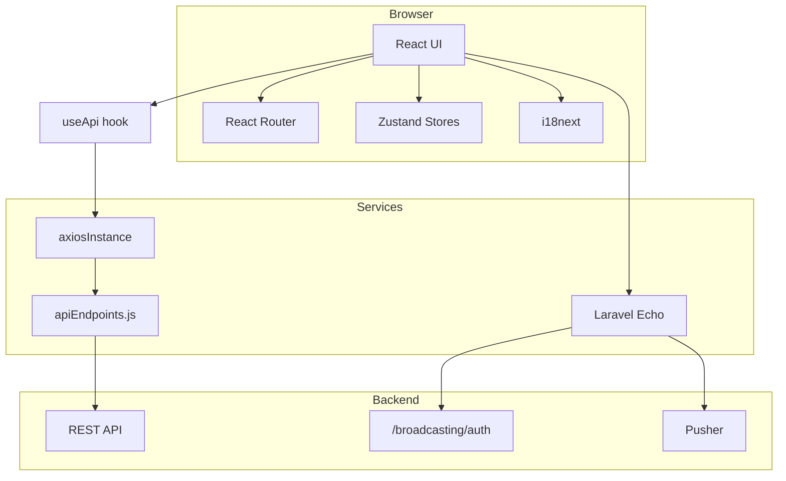
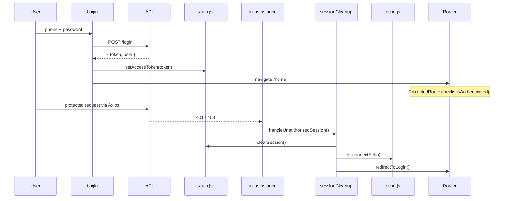
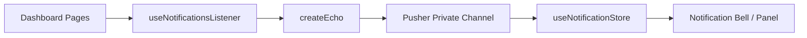

# Admin Dashboard — Architecture

An administrative single-page application (SPA) for the car rental platform. Built with React, communicating with a Laravel REST API, with real-time notifications delivered via Laravel Echo + Pusher.

> **Diagrams:** see [`dashboard-diagrams.md`](./diagrams/dashboard-diagrams.md) for C4, UML state/sequence, defense-in-depth, and deployment diagrams.

## Table of Contents

1. [Overview](#overview)
2. [Application Flow](#application-flow)
3. [Authentication Flow](#authentication-flow)
4. [Folder Structure](#folder-structure)
5. [Application Layers](#application-layers)
6. [Feature Modules](#feature-modules)
7. [Real-Time Notifications](#real-time-notifications)
8. [Internationalization (i18n)](#internationalization-i18n)
9. [Environment Variables](#environment-variables)
10. [Deployment](#deployment)
11. [API Conventions](#api-conventions)
12. [Security Summary](#security-summary)

---

## Overview

| Property | Value |
|---|---|
| Type | Single Page Application (SPA) |
| Base path | `/dashboard/` |
| Languages | Arabic (default), English |
| Direction | RTL / LTR, driven by active language |
| Authentication | JWT Bearer token |
| Deployment | Docker + Nginx |

---

## Application Flow



---

## Authentication Flow



**Key files:**

| File | Responsibility |
|---|---|
| `src/features/auth/pages/Login.jsx` | Login screen |
| `src/utils/auth.js` | Token and session management |
| `src/utils/sessionCleanup.js` | Clears session on 401/403 |
| `src/components/ProtectedRoute.jsx` | Route-level access guard |
| `src/components/GuestRoute.jsx` | Blocks `/login` access for already-authenticated sessions |
| `src/services/axiosInstance.js` | Attaches Bearer token + `x-api-key` |
| `src/components/LogoutButton.jsx` | Logout handler |

---

## Folder Structure

```
src/
├── app/                    # entry point
│   ├── App.jsx             # Router + i18n direction + ScrollToTop
│   ├── routes.jsx          # route table
│   └── i18n.js             # i18next setup
├── page/                   # standalone top-level pages
├── features/                # feature-based domain modules
│   ├── auth/  office/  cars/  bookings/  airport-requests/
│   ├── reports/  ads/  coupons/  messages/  notifications/
│   ├── points/  users/  contact/  rental-terms/
├── components/              # shared UI across features
├── layouts/                 # sidebar, overall layout shell
├── hooks/                   # useApi, useNotificationsListener
├── services/                # axios, apiEndpoints, echo
├── store/                   # Zustand (user, loading, notifications)
├── utils/                   # auth, sessionCleanup
└── styles/
```

**Organizing principle — feature-based structure:** every business domain lives under `src/features/<domain>/`, each with its own `pages/` and `components/`, while genuinely cross-cutting UI (`ProtectedRoute`, `LoadingSpinner`) stays in the shared `components/` directory. This keeps domain logic isolated while avoiding duplication of shared primitives.

---

## Application Layers

### 1. Presentation

- **Pages** (`pages/`) — compose data fetching and layout for a full screen.
- **Components** (`components/`) — reusable within a feature or globally.
- **Layout** (`layouts/Sidebar.jsx`) — persistent sidebar, language switcher, logout.

### 2. State

| Store | File | Purpose |
|---|---|---|
| User | `useUserStore.js` | Authenticated user data |
| Loading | `useLoadingStore.js` | Global loading indicator (driven by `useApi`) |
| Notifications | `useNotificationStore.js` | Pusher-delivered notifications |

> The auth token itself lives in `localStorage` via `auth.js` — deliberately **not** persisted through Zustand, keeping session storage and UI state as separate concerns.

### 3. Data Layer

```
Page → useApi() → axiosInstance → apiEndpoints → Backend API
```

- **`useApi`** wraps every request, checks `response.data.success`, and surfaces `error`/`fieldErrors` in a consistent shape to the UI.
- **`apiEndpoints.js`** is the single source of truth for every API path.
- **`axiosInstance`** centralizes `baseURL`, `x-api-key`, `Authorization`, and security-related interceptors.

### 4. Routing

- Mounted under **basename `/dashboard/`** in both Vite and React Router config.
- Every route except `/login` is wrapped in `<ProtectedRoute>`.
- `ScrollToTop` resets scroll position on route change.

---

## Feature Modules

| Feature | Route | Description |
|---|---|---|
| Home | `/home` | Quick-access overview |
| Offices | `/offices` | CRUD for rental offices, offers, financials |
| Cars | `/cars` | Vehicles scoped per office, detail/edit |
| Bookings | `/bookings/unfinished` | Incomplete bookings |
| Airport Requests | `/airport-requests` | Airport delivery requests |
| Reports | `/reports` | Financial summaries with coupon filters |
| Ratings | `/ratings` | Ratings report |
| Ads | `/ads` | Advertisement management |
| Coupons | `/coupons` | Discounts, scoped by rental type |
| Messages | `/messages` | Outbound messaging |
| Points Rules | `/points-rules` | Loyalty point configuration |
| Users | `/users` | User management |
| Contact Info | `/contact-info` | Contact information |
| Rental Terms | `/rental-terms` | Terms display |

### Example Flow — Offices & Offers

```
/offices              → office list
/offices/create       → create office (FormData)
/offices/:id          → detail + offers (GET offers)
/offices/:id/edit     → edit
/offices/:id/finance  → financial transactions
```

### Example Flow — Cars

```
/cars?office=5        → cars scoped to an office (office id preserved in query)
/cars/:id?office=5    → car detail
                      → back-navigation restores /cars?office=5
```

---

## Real-Time Notifications



- Echo connects **only** when a valid token exists.
- Private channel scoped per user: `user.{id}`.
- Event: `.request.made`.

---

## Internationalization (i18n)

- Translation files: `public/locales/{ar|en}/translation.json`, loaded over HTTP at runtime.
- `document.documentElement.dir` is updated in `App.jsx` based on the active language.
- Nested keys used where needed (e.g. `price_type.daily`).
- Dynamic keys use helper functions with Arabic/English fallbacks.

**UI design tokens:** primary `#F4C034` (gold), secondary `#1E1E5C` (navy); Tailwind CSS for styling; `react-icons`/`lucide-react` for icons; `recharts` for reporting charts; `react-leaflet` for maps.

---

## Environment Variables

| Variable | Purpose |
|---|---|
| `VITE_API_BASE_URL` | REST API base URL |
| `VITE_API_BASE_URL_file` | Media/file asset base URL |
| `VITE_API_KEY` | `x-api-key` header (public identifier, not a secret) |
| `VITE_PUSHER_KEY` / `VITE_PUSHER_CLUSTER` | Pusher configuration |
| `VITE_BROADCAST_AUTH_URL` | Private-channel broadcast authentication |

> Injected at **build time** via Docker/Vite — these are not runtime secrets, and are treated accordingly in the security model below.

---

## Deployment

```
npm run build → dist/
Docker: build stage → nginx serves /dashboard/  (default container port 8080)
```

`nginx.conf` handles SPA fallback routing and sets security-related HTTP headers.

---

## API Conventions

**Success:**
```json
{ "success": true, "message": "...", "data": {} }
```

**Error:**
```json
{ "success": false, "message": "...", "errors": { "field": ["..."] } }
```

- File uploads use `multipart/form-data` (offices, cars, ads).
- Some updates use `POST` rather than `PUT`, following backend conventions.
- Boolean values are frequently transmitted as `1`/`0` within `FormData`.

---

## Security Summary

- JWT stored in `localStorage`, with expiry checked client-side.
- A dedicated interceptor handles 401/403 by clearing the session and redirecting to login — consistently, from a single code path.
- No hardcoded tokens anywhere in the codebase.
- Security-related HTTP headers set at the Nginx layer.
- Client-side image size validation (e.g. 300 KB for vehicle photos) as a UX convenience — **actual enforcement happens server-side**, since client-side checks are never treated as a security boundary.

---

## Adding a New Feature — Quick Path

1. Add the relevant endpoints to `apiEndpoints.js`.
2. Create `src/features/<name>/pages/`.
3. Register the route in `routes.jsx`, wrapped in `<ProtectedRoute>`.
4. Add a sidebar link in `layouts/Sidebar.jsx`.
5. Add translation keys to both `public/locales/ar` and `en`.
6. Use `useApi` and the shared layout components for consistency with the rest of the codebase.
