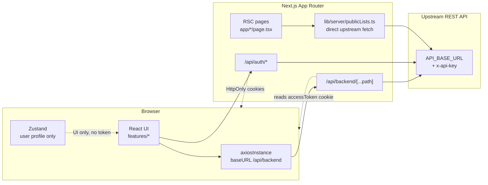
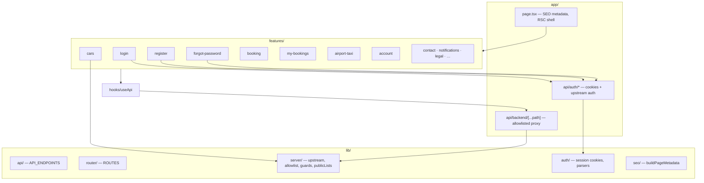
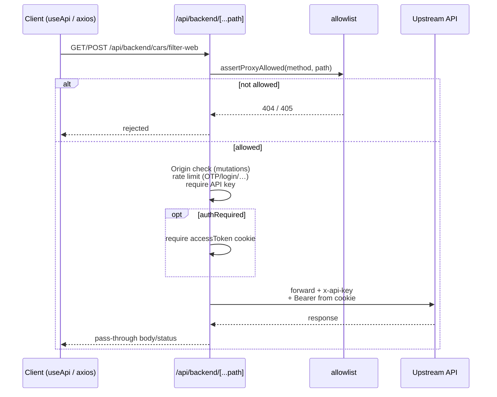
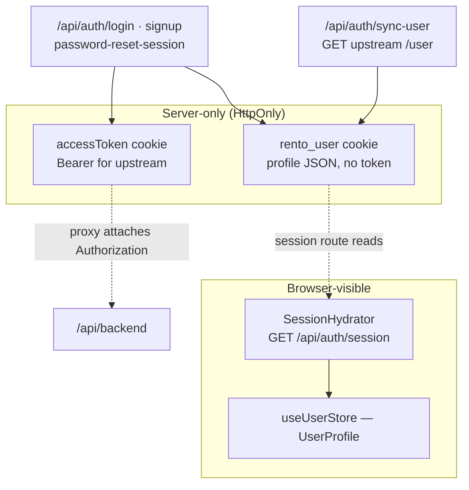
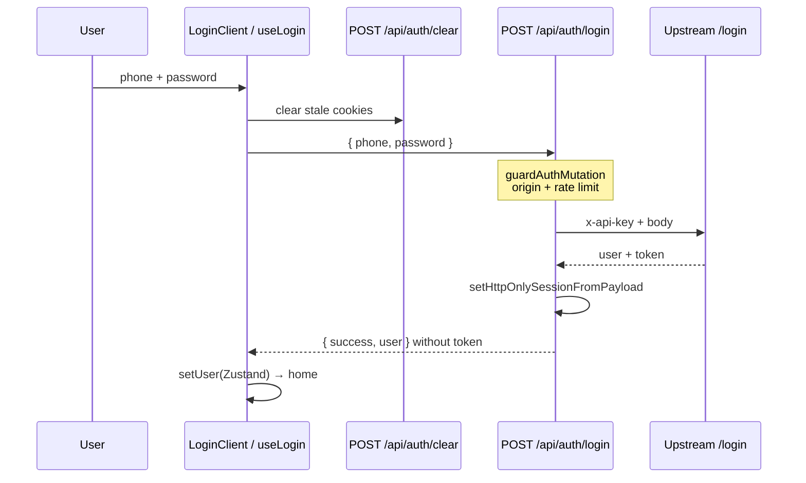
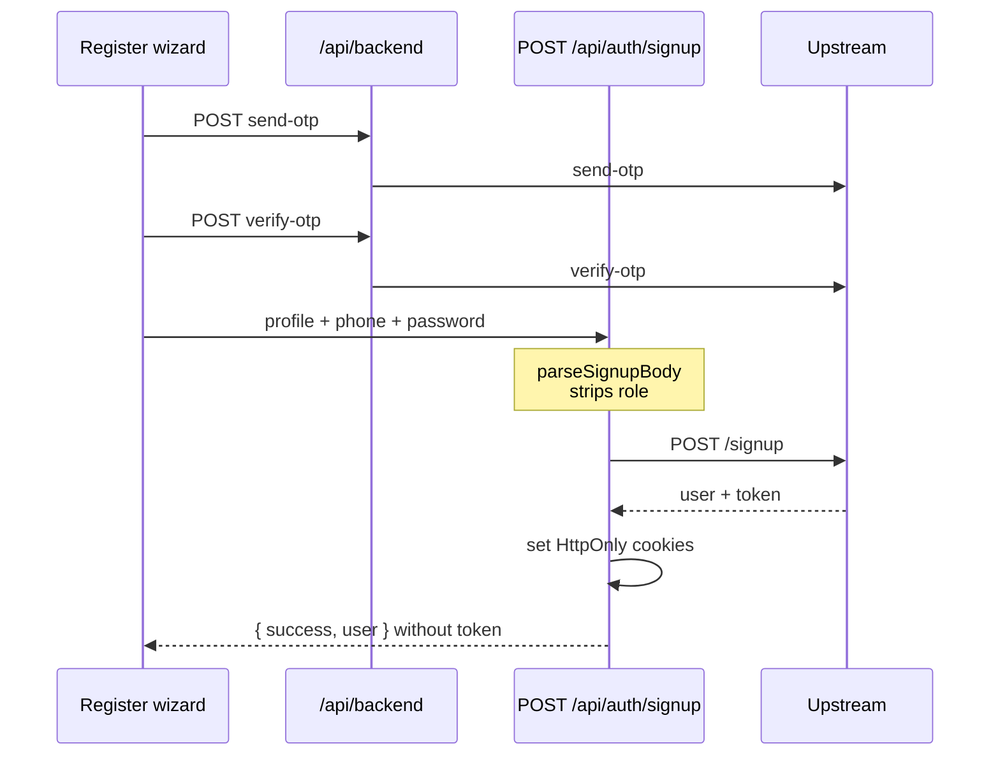
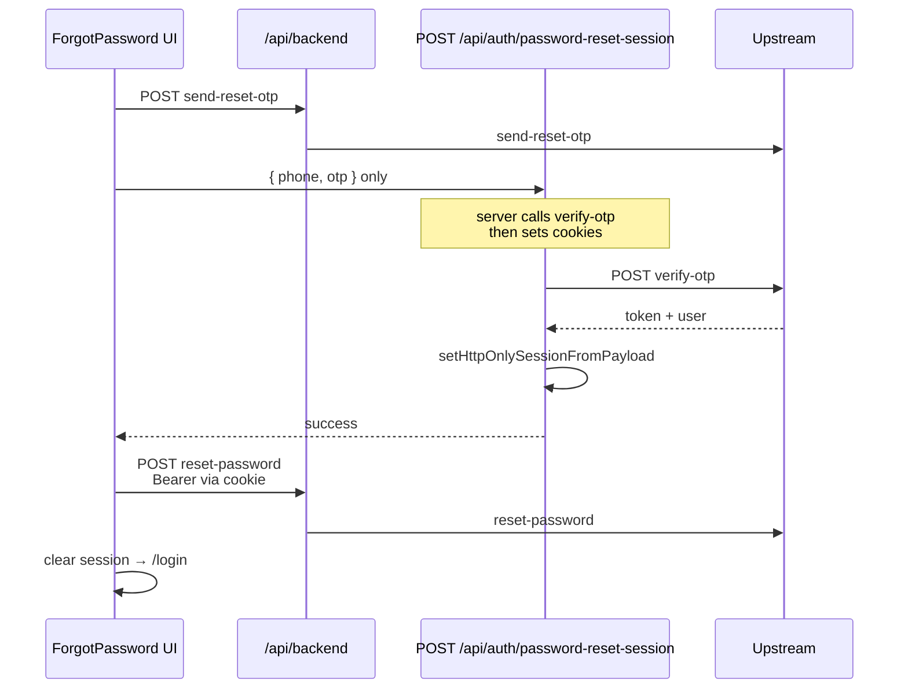
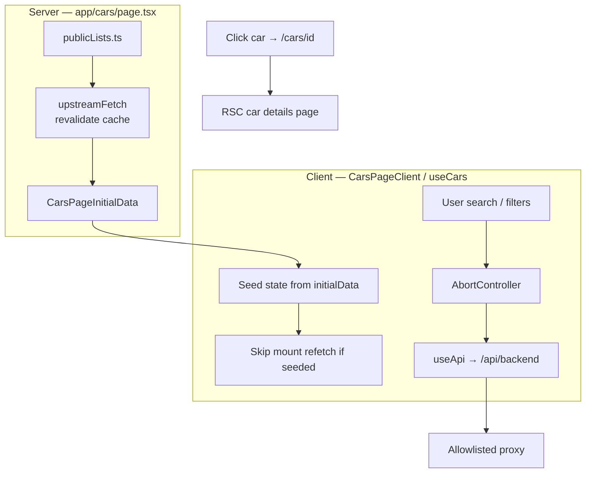
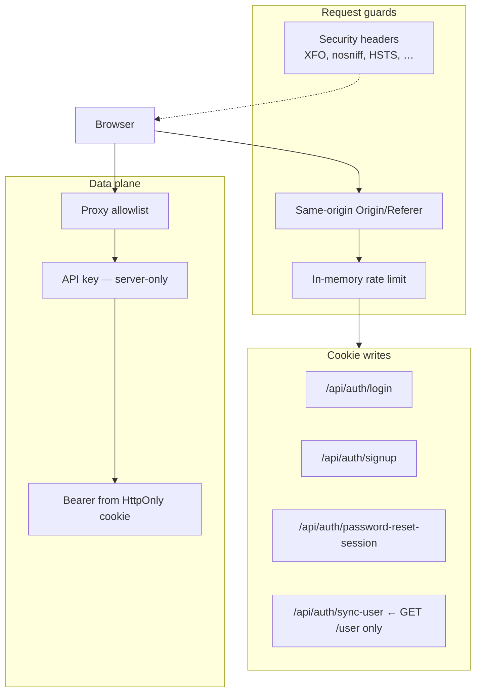

# Customer Web — Architecture Diagrams

Visual overview of the most important parts of the Customer Web application.
Diagrams use [Mermaid](https://mermaid.js.org/) (renders natively on GitHub and most Markdown previews).

**Related:** [web-architecture.md](../web-architecture.md)

---

## Table of Contents

1. [High-Level System](#1-high-level-system)
2. [Project Layout (Feature Map)](#2-project-layout-feature-map)
3. [BFF Proxy & Allowlist](#3-bff-proxy--allowlist)
4. [Session Cookies & Client State](#4-session-cookies--client-state)
5. [Login Flow](#5-login-flow)
6. [Register Flow](#6-register-flow)
7. [Forgot-Password Flow](#7-forgot-password-flow)
8. [Public Data: Cars Page (RSC + Client)](#8-public-data-cars-page-rsc--client)
9. [Car Details & Booking](#9-car-details--booking)
10. [Security Layers](#10-security-layers)

---

## 1. High-Level System

The browser never talks to the upstream API with secrets. Next.js acts as a **BFF** (Backend for Frontend).



---

## 2. Project Layout (Feature Map)



---

## 3. BFF Proxy & Allowlist

Every browser CRUD/list call goes through the proxy. Unknown paths never receive the server-only API key.



**Key files**

- `app/api/backend/[...path]/route.ts`
- `lib/server/backendProxyAllowlist.ts`
- `lib/server/requestGuard.ts`
- `lib/api/index.ts` (`API_ENDPOINTS`)

---

## 4. Session Cookies & Client State



**Rule:** the client never stores the access token for API calls. Zustand is UI state only — the HttpOnly cookie is always the source of truth.

---

## 5. Login Flow



---

## 6. Register Flow



---

## 7. Forgot-Password Flow

OTP verification for the reset **session** happens on the server — no client-submitted token is ever trusted into a cookie.



---

## 8. Public Data: Cars Page (RSC + Client)



This dual-path design (server-prefetched initial state + client-side refetch only on real user interaction) avoids a redundant fetch on first paint while keeping search and filtering fully dynamic. `AbortController` cancels stale in-flight searches so a fast typist never sees an old response overwrite a newer one.

**Related:** airports on `/airport-taxi` use the same prefetch pattern.

---

## 9. Car Details & Booking

```mermaid
sequenceDiagram
  participant List as /cars list
  participant Detail as /cars/[id] RSC + client
  participant Verify as bookings/verify
  participant Checkout as /bookings/checkout
  participant Create as POST /bookings multipart
  participant API as Upstream

  List->>Detail: navigate ROUTES.CAR_DETAILS(id)
  Detail->>API: GET /cars/id (server prefetch)
  Detail->>Detail: Product JSON-LD + UI
  Note over Detail: user picks dates / delivery
  Detail->>Verify: useApi POST bookings/verify
  Verify->>API: verify
  API-->>Verify: ok
  Detail->>Checkout: save session → navigate
  Checkout->>Create: create booking FormData
  Create->>API: POST /bookings
  Checkout->>Checkout: success → my bookings
```

Booking availability is verified in a separate step **before** checkout, rather than only at final submission — surfacing conflicts (e.g. a vehicle just booked by someone else) earlier in the flow instead of after the customer has filled out the full checkout form.

---

## 10. Security Layers



Only four routes are permitted to write session cookies (`login`, `signup`, `password-reset-session`, `sync-user`) — every other authenticated call flows through the generic proxy and only ever *reads* the existing cookie. This narrows the "who can create a session" surface to a small, auditable set of code paths.

---

## Quick Reference — Important Paths

| Concern | Path |
|---|---|
| Routes | `lib/router/index.ts` |
| API segments | `lib/api/index.ts` |
| Proxy | `app/api/backend/[...path]/route.ts` |
| Allowlist | `lib/server/backendProxyAllowlist.ts` |
| Guards | `lib/server/requestGuard.ts` |
| RSC public fetch | `lib/server/publicLists.ts`, `upstreamFetch.ts` |
| Session cookies | `lib/auth/session.server.ts` |
| Client API | `hooks/useApi.ts`, `services/axiosInstance.ts` |
| Cars UI | `features/cars/` |
| Booking | `features/booking/` |
| Auth UI | `features/login`, `register`, `forgot-password` |
