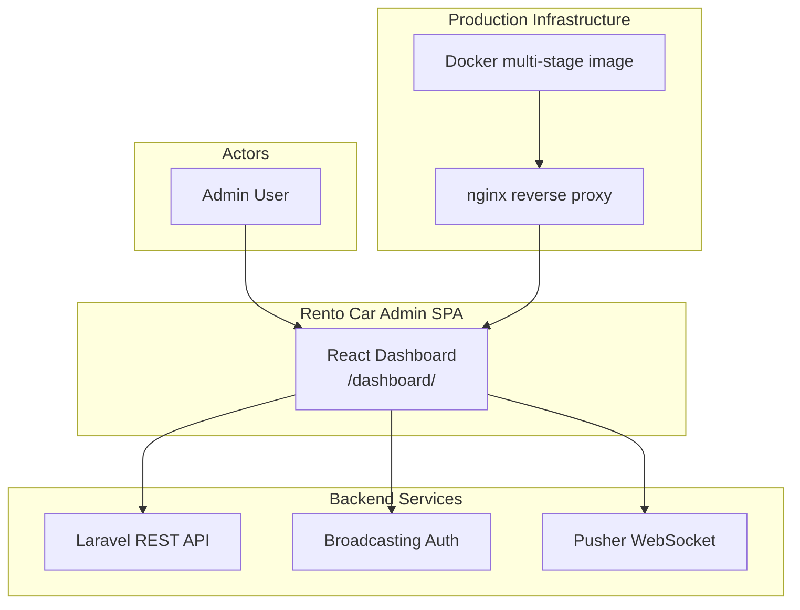
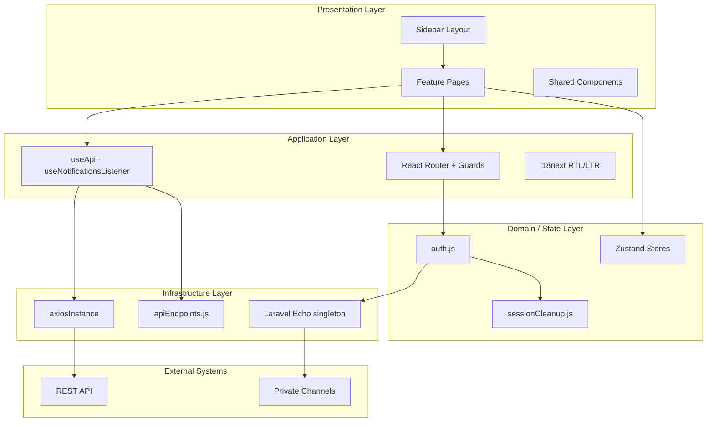
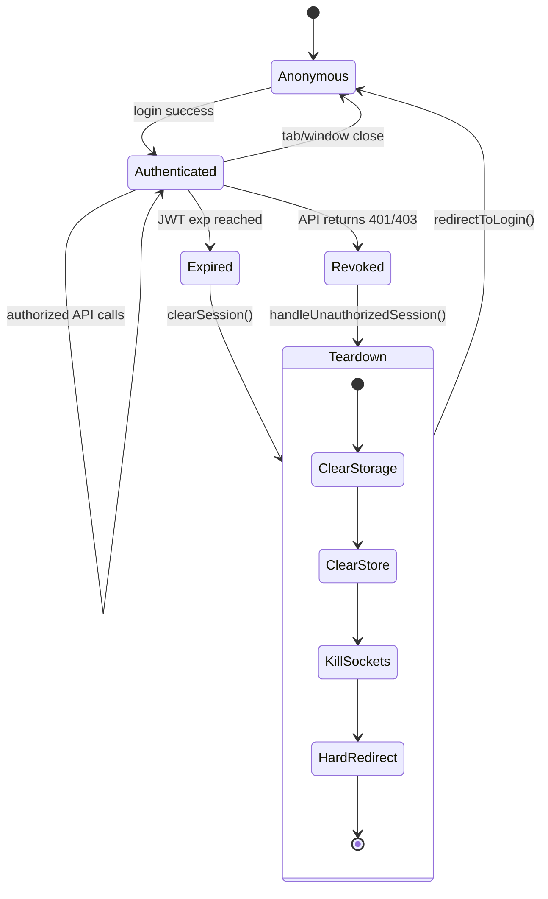
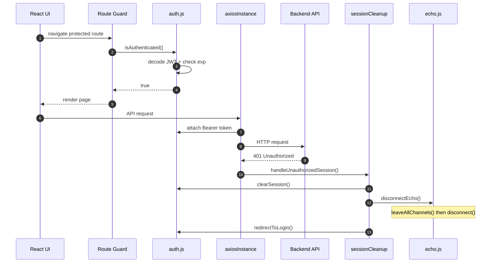
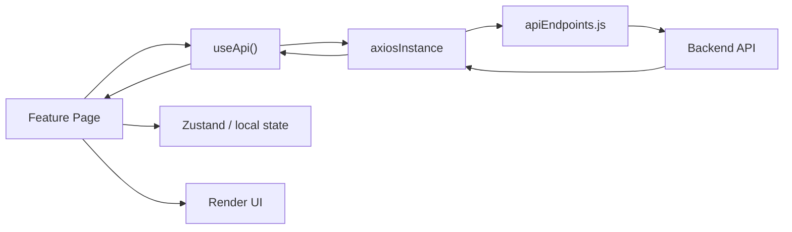
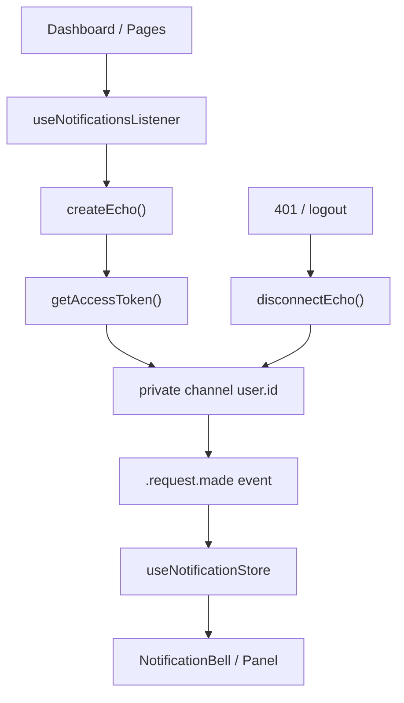
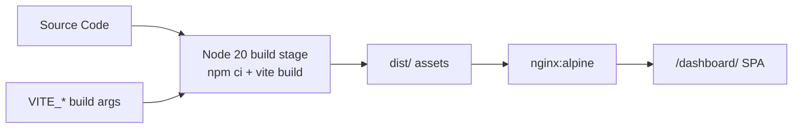

# Admin Dashboard — Architecture Diagrams

Enterprise-grade architecture diagrams for the Rento Car Admin Dashboard codebase.
Render with any Mermaid-compatible viewer (GitHub, GitLab, VS Code, Obsidian).

**Related:** [dashboard-architecture.md](../dashboard-architecture.md)

---

## Diagram Index

| # | Diagram | Standard |
|---|---|---|
| 1 | [System Context](#1-system-context-c4-level-1) | C4 Level 1 |
| 2 | [Layered Architecture](#2-layered-application-architecture) | Layered Design |
| 3 | [Session State Machine](#3-session-state-machine) | UML State |
| 4 | [401 Session Teardown](#4-401-session-teardown-sequence) | UML Sequence |
| 5 | [Defense in Depth](#5-defense-in-depth-model) | Security Model |
| 6 | [Data Flow](#6-data-flow-rest-layer) | REST Pipeline |
| 7 | [Real-Time Flow](#7-real-time-notification-flow) | Event-Driven |
| 8 | [Deployment Pipeline](#8-deployment-pipeline) | Docker Multi-Stage |

---

## 1. System Context (C4 Level 1)

How the admin SPA interacts with backend services and production infrastructure.

**Key files:** `Dockerfile`, `nginx.conf`, `src/services/axiosInstance.js`, `src/services/echo.js`

---

## 2. Layered Application Architecture

Separation of presentation, application, domain, and infrastructure concerns.

**Key files:** `src/features/`, `src/hooks/`, `src/utils/`, `src/services/`

---

## 3. Session State Machine

Session lifecycle from anonymous access through coordinated teardown.

**Key files:** `src/utils/auth.js`, `src/utils/sessionCleanup.js`, `src/components/ProtectedRoute.jsx`

---

## 4. 401 Session Teardown Sequence

UML sequence when authorization fails. An orchestrator coordinates auth, WebSocket, and navigation cleanup as a single atomic operation — rather than leaving each concern to clean up independently and risk an inconsistent half-logged-out state.

**Key files:** `src/services/axiosInstance.js`, `src/utils/sessionCleanup.js`, `src/services/echo.js`

---

## 5. Defense in Depth Model

Five security layers, from proactive client-side checks through to edge hardening. No single layer is trusted as the sole line of defense.

```mermaid
flowchart LR
    subgraph L1["Layer 1 — Proactive"]
        A1["Route Guards"]
        A2["JWT exp validation"]
    end

    subgraph L2["Layer 2 — Reactive"]
        B1["401/403 interceptor"]
        B2["Auth endpoint exclusion"]
    end

    subgraph L3["Layer 3 — Orchestration"]
        C1["handleUnauthorizedSession()"]
    end

    subgraph L4["Layer 4 — State Purge"]
        D1["localStorage"]
        D2["Zustand store"]
        D3["WebSocket teardown"]
        D4["Hard redirect"]
    end

    subgraph L5["Layer 5 — Edge"]
        E1["nginx security headers"]
        E2["TLS + forceTLS"]
    end

    L1 --> L2 --> L3 --> L4
    L5 -.-> L1
```

**Key files:** `nginx.conf`, `src/utils/auth.js`, `src/services/axiosInstance.js`, `src/services/echo.js`

---

## 6. Data Flow (REST Layer)

Standard request path from feature pages to the backend API.

**Key files:** `src/hooks/useApi.js`, `src/services/apiEndpoints.js`, `src/services/axiosInstance.js`

---

## 7. Real-Time Notification Flow

Private channel subscription with Bearer auth and coordinated teardown on logout or 401.

**Key files:** `src/hooks/useNotificationsListener.js`, `src/services/echo.js`, `src/store/useNotificationStore.js`

---

## 8. Deployment Pipeline

Production build and serve flow via a Docker multi-stage image.

**Key files:** `Dockerfile`, `docker-compose.yml`, `nginx.conf`, `.env.example`

---

## Conventions

| Standard | Usage in this project |
|---|---|
| **C4 Model** | System context and container boundaries |
| **UML Sequence** | Auth failure and session teardown |
| **UML State** | Session lifecycle states |
| **Layered Architecture** | `features/` · `hooks/` · `utils/` · `services/` |
| **Defense in Depth** | Guards → interceptors → orchestrator → edge |

---

## Viewing Diagrams Locally

**VS Code:** install the [Markdown Preview Mermaid Support](https://marketplace.visualstudio.com/items?itemName=bierner.markdown-mermaid) extension, then open this file and preview.

**GitHub / GitLab:** Mermaid blocks render natively in the repository UI — no setup required.
