# Mobile App — Key Architecture Diagrams

Mermaid diagrams for the most important parts of the Rento Flutter app (Customer + Office).
View in GitHub, VS Code (Markdown Preview Mermaid), or any Mermaid-compatible viewer.

**Related:** [mobile-architecture.md](../mobile-architecture.md)

---

## Index

| # | Diagram | What it shows |
|---|---|---|
| 1 | [System Context](#1-system-context) | App ↔ API ↔ Firebase ↔ Maps |
| 2 | [App Bootstrap](#2-app-bootstrap) | Startup order |
| 3 | [Role-Based Routing](#3-role-based-routing) | Customer / Office / Guest |
| 4 | [Customer Home Tabs](#4-customer-home-tabs) | Main customer shell |
| 5 | [Office Home Tabs](#5-office-home-tabs) | Main office shell + BLoCs |
| 6 | [Office Clean Architecture](#6-office-clean-architecture) | presentation → domain → data |
| 7 | [Auth & Secure Token Flow](#7-auth--secure-token-flow) | Login / storage / logout |
| 8 | [HTTP Request Pipeline](#8-http-request-pipeline) | Dio + errors + redacted logs |
| 9 | [Customer Booking Flow](#9-customer-booking-flow) | Search → checkout → history |
| 10 | [Office Order Handling](#10-office-order-handling) | Accept / reject / delivery |
| 11 | [Push Notifications](#11-push-notifications) | FCM + local + dedupe |
| 12 | [Image Caching](#12-image-caching) | CachedCarImage + decode bounds |
| 13 | [Security Boundaries](#13-security-boundaries) | What is protected, and how |
| 14 | [Test Coverage Map](#14-test-coverage-map) | What automated tests cover |

---

## 1. System Context

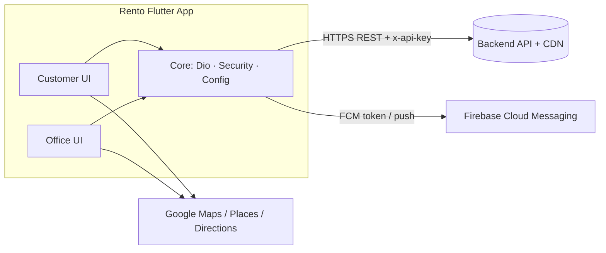

---

## 2. App Bootstrap

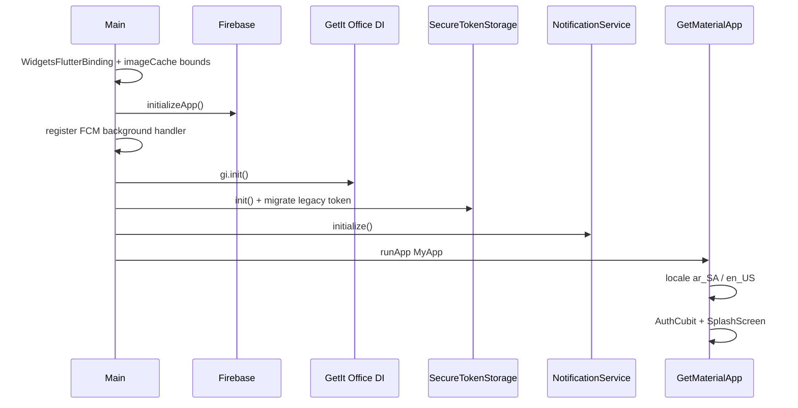

Deliberate sequencing: security (secure storage init + legacy token migration) and notification registration both complete **before** the app renders its first authenticated screen, avoiding race conditions where a screen could momentarily render with stale or missing auth state.

---

## 3. Role-Based Routing

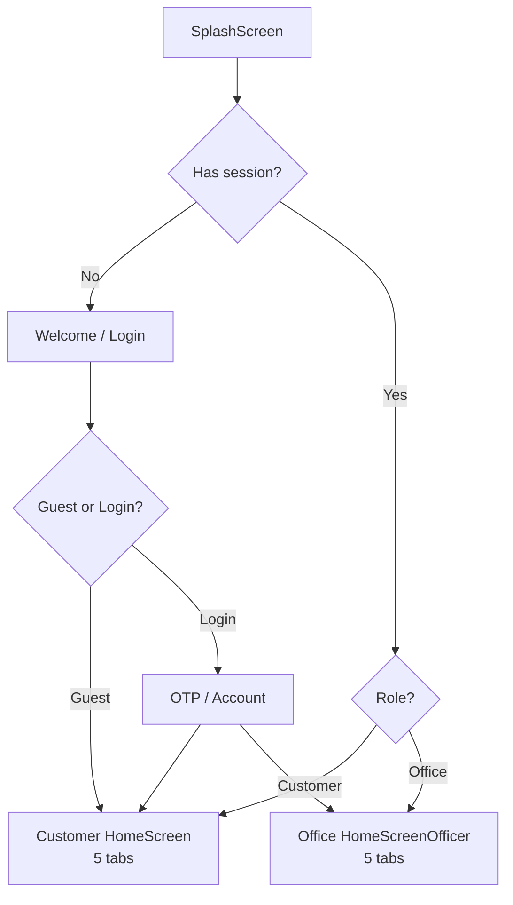

---

## 4. Customer Home Tabs

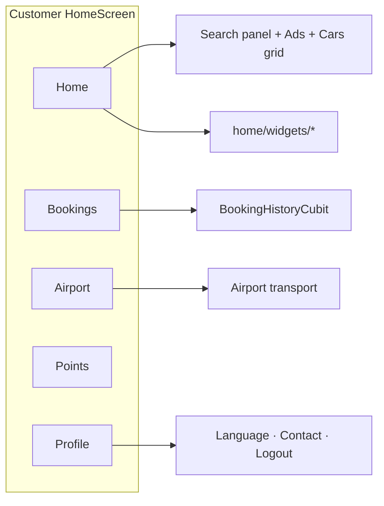

---

## 5. Office Home Tabs

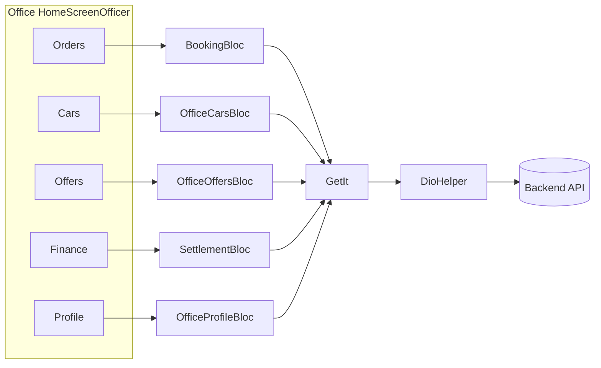

---

## 6. Office Clean Architecture

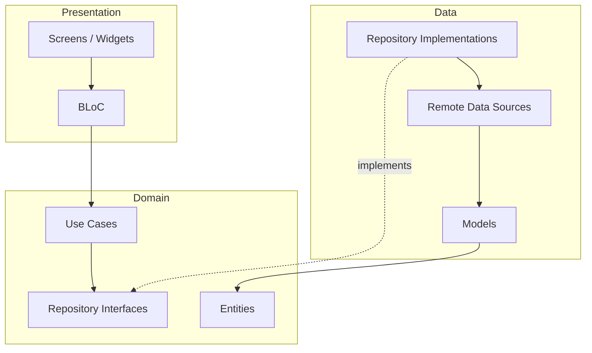

Example feature folders: `office_cars`, `office_offers`, `office_orders`, `office_profile`, `finance`.

---

## 7. Auth & Secure Token Flow

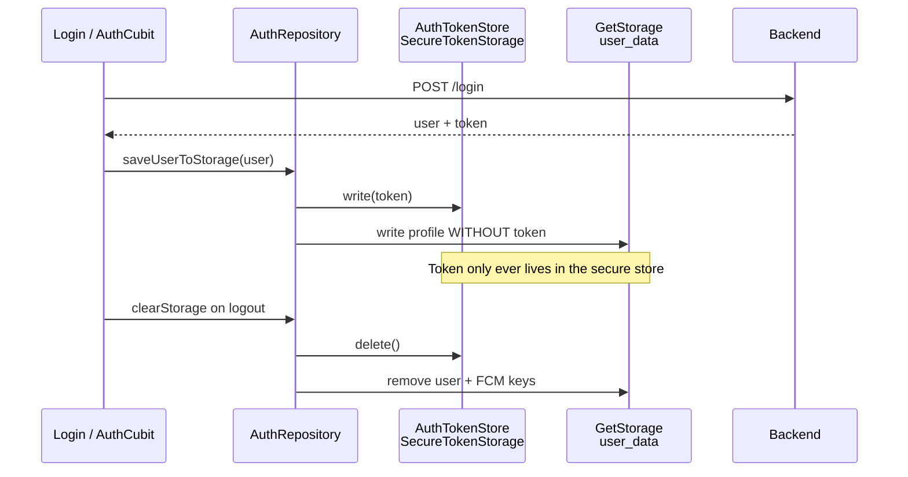

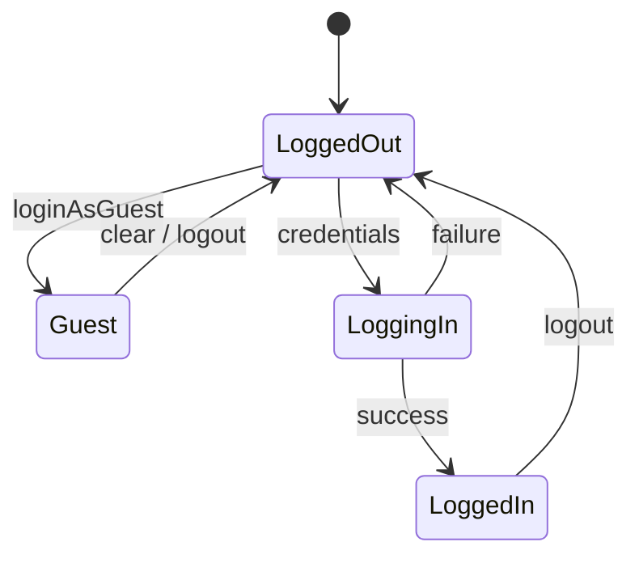

**Key design decision:** the profile snapshot cached in `GetStorage` (unencrypted, used for fast UI reads) is structurally prevented from ever containing the token field — token storage and profile storage are two separate write paths, not one object split after the fact.

---

## 8. HTTP Request Pipeline

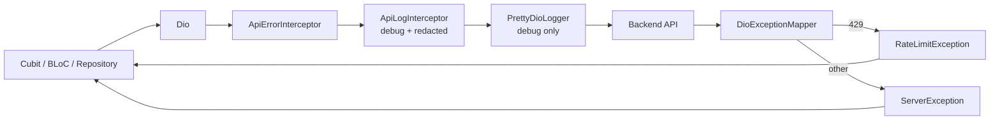

Sensitive fields (`token`, `phone`, `email`, OTP, document paths, …) are masked by a dedicated log-redaction layer **before** anything reaches debug logs — so verbose logging during development never becomes an accidental data-leak surface.

---

## 9. Customer Booking Flow

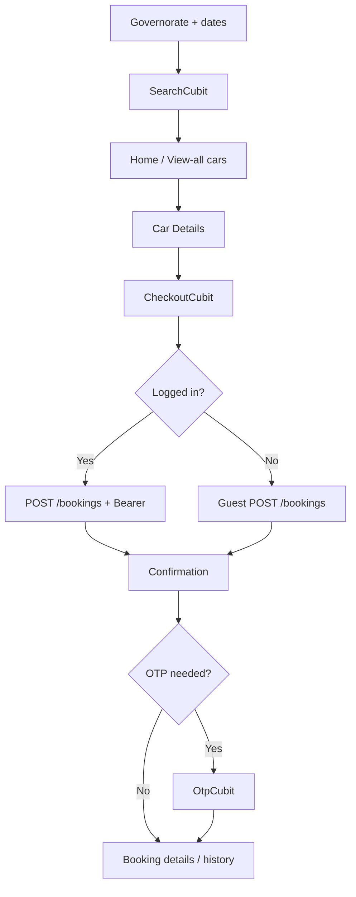

---

## 10. Office Order Handling

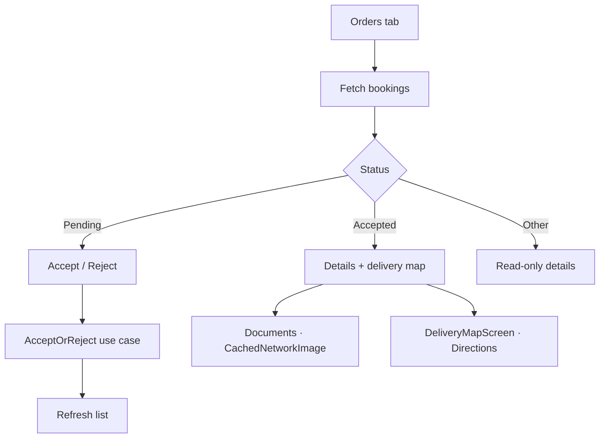

---

## 11. Push Notifications

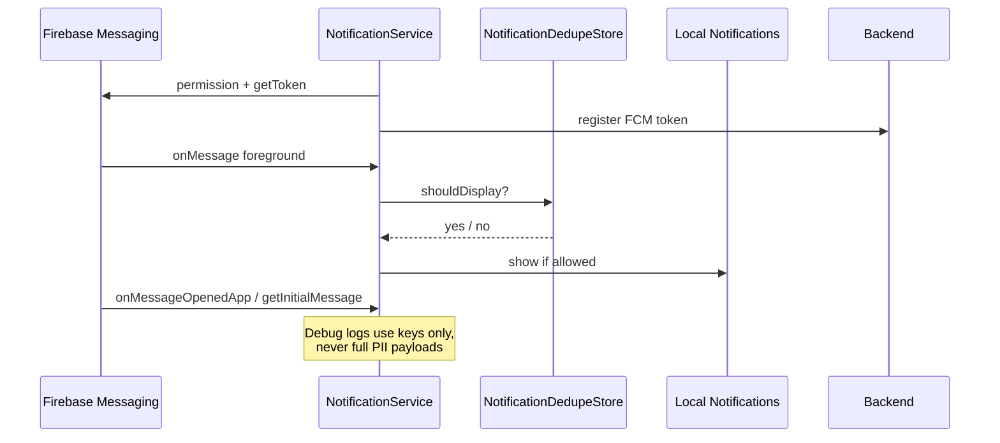

A dedicated dedupe store prevents the same push event from surfacing twice across foreground/background/terminated app states — a subtlety that's easy to miss until it produces duplicate notifications in production.

---

## 12. Image Caching

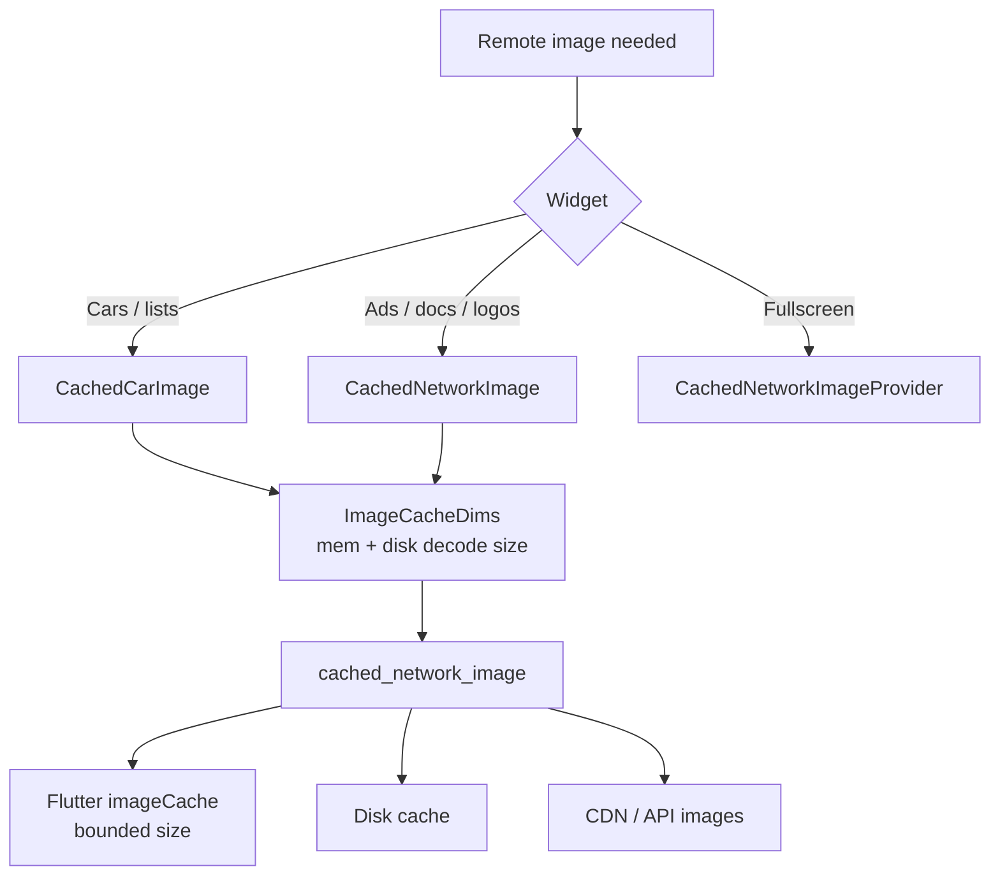

Explicit decode-size bounds prevent full-resolution images from being decoded into memory just to render a small thumbnail — a common, easy-to-miss source of memory pressure and jank on lower-end devices.

---

## 13. Security Boundaries

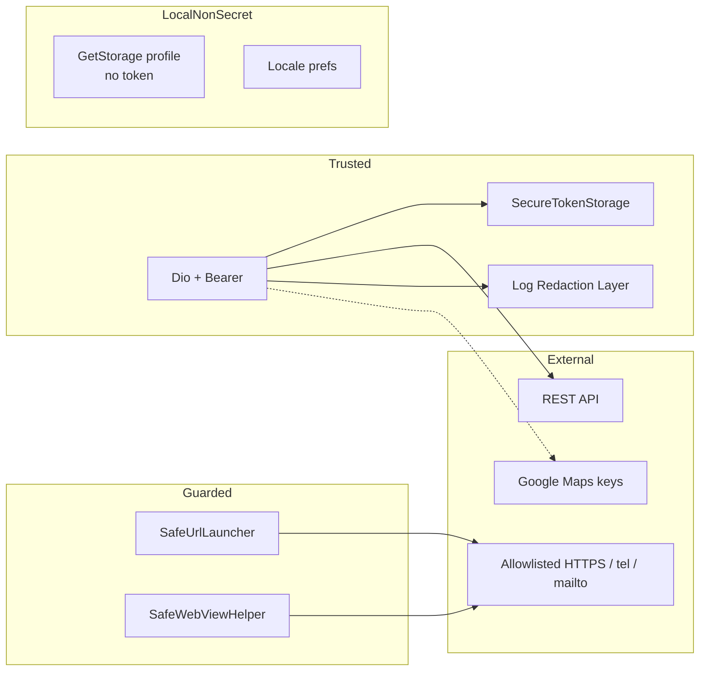

`SafeUrlLauncher` and `SafeWebViewHelper` exist specifically to prevent the app from opening arbitrary or attacker-controlled URLs/schemes from dynamic content (e.g. a malicious link embedded in a message or document) — a boundary that's easy to overlook until it's exploited.

---

## 14. Test Coverage Map

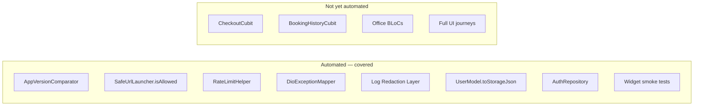

Documenting coverage gaps explicitly — rather than only showing what's covered — reflects the same trade-offs-first engineering approach used throughout this documentation set: a clear, honest picture of where the system stands, not just where it succeeds.
