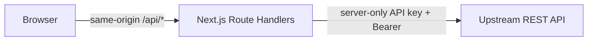
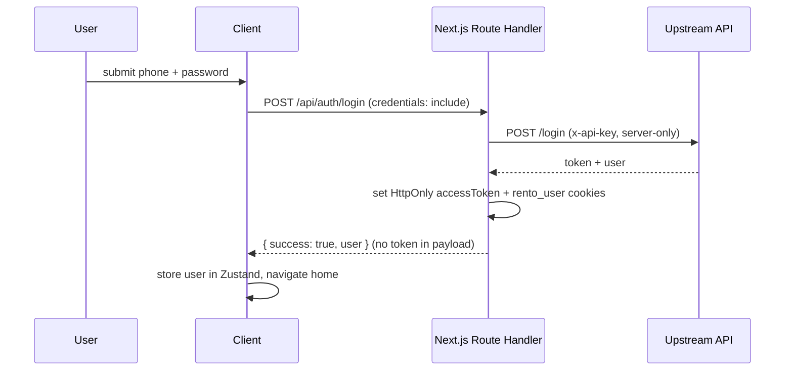
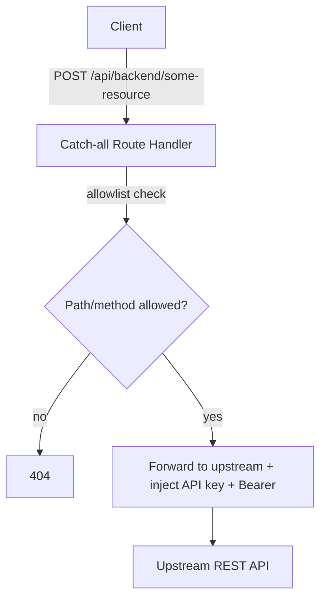

# Customer Web — Architecture & Security

**Live:** [rentocar24.com](https://rentocar24.com/)

This document describes how the Customer Web application is structured, how data flows between the browser, the Next.js server, and the upstream API, and which security measures protect that boundary.

> **Diagrams:** see [`web-diagrams.md`](./diagrams/web-diagrams.md) for the full set of Mermaid flowcharts and sequence diagrams (BFF proxy, auth flows, booking flow, security layers).

## Table of Contents

1. [High-Level Overview](#high-level-overview)
2. [Security Model](#security-model)
3. [Authentication Flows](#authentication-flows)
4. [API Access Pattern (BFF Proxy)](#api-access-pattern-bff-proxy)
5. [Session Visibility on the Client](#session-visibility-on-the-client)
6. [Project Layout](#project-layout)
7. [Rendering & Data Access](#rendering--data-access)
8. [Key Libraries](#key-libraries)
9. [Operational Notes](#operational-notes)

---

## High-Level Overview

- **Framework:** Next.js (App Router), React, TypeScript
- **Upstream API:** An external REST API. The browser **never** calls this API directly with secrets or a readable session token.
- **Browser ↔ Next.js:** Same-origin requests to `/api/*` Route Handlers only.
- **Next.js ↔ Upstream API:** Server-side `fetch` using a server-only API key and the HttpOnly `accessToken` cookie, injected as `Authorization: Bearer …` when forwarding requests.



This is a **Backend-for-Frontend (BFF)** pattern: the Next.js server acts as the only party trusted with upstream credentials, while the browser only ever talks to its own origin.

---

## Security Model

### HttpOnly Session Cookies

After a successful login, the route handler `POST /api/auth/login` sets two cookies:

| Cookie | Purpose | Flags |
|---|---|---|
| `accessToken` | Bearer token for the upstream API | `HttpOnly`, `SameSite=Lax`, `Path=/`, `Secure` in production, ~7 day `maxAge` |
| `rento_user` | JSON snapshot of the user profile, **excluding** the token | Same as above |

**Why HttpOnly matters:** client-side JavaScript cannot read these cookies, which meaningfully reduces the blast radius of a typical XSS attack attempting to steal the session token via `document.cookie`.

### API Key Stays Server-Side

- The upstream API key is read only inside Route Handlers and is never exposed via a `NEXT_PUBLIC_*` environment variable — it is not reachable from the client bundle under any circumstance.
- The browser only ever calls `/api/backend/...`; the proxy layer injects the API key when forwarding to the upstream API.

### No Bearer Token in Client Memory

- The Axios instance is scoped to `baseURL: "/api/backend"` only — it never reads or attaches a token from browser-accessible storage.
- The server-side proxy reads `accessToken` from the HttpOnly cookie and attaches `Authorization` for upstream calls (except for routes explicitly treated as pre-authentication, such as login itself).

### Client-Side User State

- **Zustand** (`useUserStore`) holds a `UserProfile` — the same fields as the backend user object, minus the token. This is used purely for UI rendering; it is **not** the source of truth for authentication. The HttpOnly cookie is.

### Consistent Phone Normalization

Every `phone` field submitted across auth flows (login, OTP send/verify, registration, password reset) is normalized through a single shared utility (digits-only, correct country-code handling, no duplicate prefixes) — keeping OTP send/verify and account creation requests aligned to the exact number the user entered.

---

## Authentication Flows

### Login



### Sign Up

1. Phone → OTP verification → profile, via the BFF proxy (`send-otp`, `verify-otp`).
2. Account creation goes through a dedicated `POST /api/auth/signup` route (not the generic proxy) so the response can set HttpOnly cookies directly from the upstream payload — the client never receives the raw token.

### Forgot Password

1. `send-reset-otp` via the proxy.
2. A dedicated `password-reset-session` route verifies the OTP upstream and sets HttpOnly cookies **from the upstream response only** — client-submitted `token`/`role` values are never trusted.
3. `reset-password` runs through the allowlisted, authenticated proxy.
4. Cookies are cleared and the user is redirected to login.

### Logout

Reads `accessToken` from the cookie, forwards a logout call upstream with Bearer + API key (when a token exists), clears HttpOnly cookies server-side, and clears client-side Zustand state.

### Session Probe & Hydration

- `GET /api/auth/session` reads cookies **server-side** and returns `{ authenticated, user }` — letting the UI reflect login state without ever touching an HttpOnly cookie directly.
- A `SessionHydrator`, mounted at the root layout, calls this on load so client state stays correct after a full page refresh.

---

## API Access Pattern (BFF Proxy)

All non-auth API calls go through a shared `useApi` hook pointed at `/api/backend/*`. A catch-all Route Handler:

1. Validates the requested path/method against an explicit **allowlist** — unlisted paths return `404`.
2. Rejects mutating requests whose Origin/Referer doesn't match the app's own origin.
3. Rebuilds the upstream URL, forwards the query string and relevant headers/body.
4. Injects the API key and, where appropriate, the `Authorization: Bearer` header from the HttpOnly cookie.



Auth-critical flows (login, signup completion, password-reset handoff) deliberately bypass this generic proxy in favor of dedicated routes, because only those routes are permitted to write HttpOnly session cookies from a backend response.

---

## Session Visibility on the Client

| Mechanism | What it knows |
|---|---|
| HttpOnly cookies | Invisible to JS; sent automatically on same-origin `/api/*` requests |
| `GET /api/auth/session` | Whether the user is authenticated, plus the safe `user` object (no token) |
| Zustand `useUserStore` | UI-facing `UserProfile`, refreshed post-login and via `SessionHydrator` |

---

## Project Layout

```
app/
├── api/auth/            # login, signup, logout, session, clear, password-reset-session
│                         # server-only secrets & cookie writes — never in the client bundle
├── api/backend/[...path]/  # catch-all allowlisted proxy to the upstream API
components/               # shared UI (SessionHydrator, nav, image handling, ...)
features/login/           # login UI + hook
features/register/        # OTP-based sign-up wizard
features/forgot-password/ # OTP-based reset wizard
lib/phone/                 # shared phone normalization for all auth flows
lib/auth/                  # cookie names, session helpers, payload extraction, types
lib/server/                # upstream base URL/API key resolution, RSC prefetch helpers
lib/router/                # centralized route path constants
hooks/useApi.ts            # shared axios wrapper, normalized success/error handling
store/                     # Zustand stores (user, loading)
i18n/locales/              # message files
```

---

## Rendering & Data Access

The application combines multiple rendering strategies depending on the data's sensitivity and volatility:

- **React Server Components** with server-side prefetching and `revalidate` for public, cacheable data (cars, ads, governorates, airports) — improving both performance and SEO.
- **Client-side interaction** for authenticated, mutable flows, always routed through the BFF proxy.
- A dedicated server-side upstream `fetch` helper for RSC prefetching bypasses the client-facing `no-store` proxy semantics, since it never touches the browser.

---

## Key Libraries

- **Next.js** — App Router, Route Handlers for auth + proxy, `output: "standalone"` for Docker
- **Axios** — HTTP client scoped strictly to `/api/backend`
- **Zustand** — lightweight client state (user profile, loading)
- **Tailwind CSS** — styling
- **Docker** — multi-stage production image

---

## Operational Notes

- **HTTPS in production** so `Secure` cookies behave as intended.
- **CORS is not a concern for the upstream API** — since the browser only ever talks to the Next.js origin, and the upstream call happens server-side.
- **Hardening already in place:** allowlisted proxy paths/methods, same-origin checks + in-memory rate limiting on auth/OTP mutations, security response headers (`X-Frame-Options`, `nosniff`, `Referrer-Policy`, `Permissions-Policy`, `HSTS`), global + route-level error boundaries, CI running lint/typecheck/build.
- **Deliberately deferred hardening (roadmap):** distributed/edge rate limiting, a formal Content Security Policy, structured logging and monitoring (e.g. Sentry) — noted explicitly rather than presented as already solved.

---

*This document reflects the current state: HttpOnly session cookies, an allowlisted BFF proxy, dedicated auth-exception routes, and standalone Next.js Docker packaging.*
